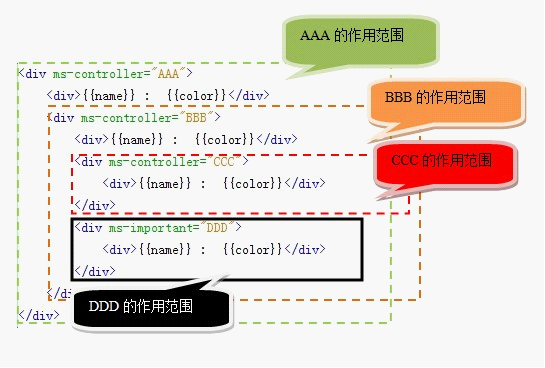

# controller绑定

这个指令是用于圈定某个VM的作用域范围(换言之,这个元素的outerHTML会被扫描编译,所有ms-*及双花括号替换成vm中的内容),ms-controller的属性值只能是某个VM的$id

ms-controller的元素节点下面的其他节点也可以使用ms-controller

每个VM的$id可以在页面上出现一次, 因此不要在ms-for内使用ms-controller.

当我们在某个指令上用@aaa时,它会先从其最近的ms-controller元素上找, 找不到再往其更上方的ms-controller元素 

```html
<script>
    avalon.define({
        $id: "AAA",
        name: "liger",
        color: "green"
    });
    avalon.define({
        $id: "BBB",
        name: "sphinx",
        color: "red"
    });
    avalon.define({
        $id: "CCC",
        name: "dragon" //不存在color

    });
    avalon.define({
        $id: "DDD",
        name: "sirenia" //不存在color

    });
</script>
<div ms-controller="AAA">
    <div>{{@name}} : {{@color}}</div>
    <div ms-controller="BBB">
        <div>{{@name}} : {{@color}}</div>
        <div ms-controller="CCC">
            <div>{{@name}} : {{@color}}</div>
        </div>
        <div ms-important="DDD">
            <div>{{@name}} : {{@color}}</div>
        </div>
    </div>
</div>
```

当avalon的扫描引擎打描到ms-controller/ms-important所在元素时, 会尝试移除ms-controller类名.因此基于此特性,我们可以在首页渲染页面时, 想挡住双花括号乱码问题,可以尝试这样干(与avalon1有点不一样):

```css
  .ms-controller{
     visibility: hidden;
  }
```