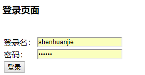
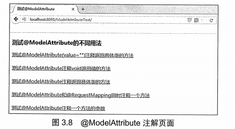
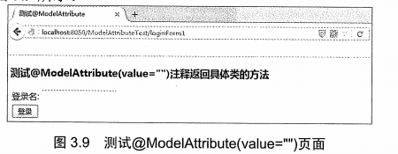
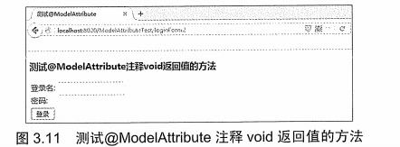

# 第3章 Spring MVC的常用注解

**本章要点**

* @Controller注解
* @RequestMapping注解
* @RequestParam注解
* @PathVariable注解
* @RequestHeader注解
* @CookieValue注解
* @SessionAttributes注解
* @ModelAttribute注解
* 转换JSON数据
* 转换XML数据

Spring 从2.5版开始引入注解，用户可以使用@Controller、@RequestMapping、@RequestParam/@ModelAttribute等类似这样的注解。到目前为止，Spring的版本虽然发生了很大的变化，但注解的特性却一直延续下来，并不断扩展，让广大开发者的工作变得更轻松。这都离不开Annotation的强大作用，本章将重点讲解Spring MVC 4中常用的注解。

## 3.1 @Controller注解

org.springframework.stereotype.Controller注解类型用于指示Spring类的实例是一个控制器，使用@Controller注解的类不需要继续特定的父类或者实现特定的接口，相对之前的版本实现Controller接口变得更加简单。而且Controller接口的实现类智能处理一个单一请求动作，而@Controller注解的控制器可以支持同时处理多个请求动作，更加灵活。

@Controller用于标记一个类，使用它标记的类就是一个SpringMVC Controller对象，即一个控制器类。Spring使用扫描机制查找应用程序中所有基于注解的控制器类。分发处理器会扫描使用了该注解的类的方法，并检测该方法是否使用了@RequestMapping注解，而使用@RequestMapping注解的方法才是真正处理请求的处理器。为了保证Spring能找到控制器，需要完成两件事情：

* 在Spring MVC 的配置文件的头文件中引入spring-context。
* 使用`<context:component-scan/>`元素，该元素的功能为：启动包扫描功能，以便注册带有@Controller、@Service、@repository、@Component等注解的类成为Spring 的Bean。base-package属性指定了需要扫描的类包，类包及其递归子包中所有的类都会被处理。

配置文件如下所示

```xml
<!--spring可以自动去扫描base-pack下面的包或者子包下面的Java文件，如果扫描到有Spring的相关注解的类，则把这些内注册为Spring的bean-->
<context:component-scan base-package="org.fkit.controller"/>
```

应该讲所有控制器类都放在基本包下，并且指定扫描该包，即org.fkit.controller，而不应该指定扫描org.fkit包，以免Spring MVC扫描了无关的包。

**示例：@Controller注解的使用**

新建一个项目ControllerTest，加入所需的.jar文件，示例代码如下：

```java
package org.fkit.controller;

import org.springframework.stereotype.Controller;
import org.springframework.ui.Model;
import org.springframework.web.bind.annotation.RequestMapping;

@Controller
public class HelloWorldController {
    @RequestMapping("/helloWorld")
    public String helloWorld(Model model){
        model.addAttribute("message","Hello World!");
        return "helloWorld";
    }
}
```

HelloWorldController是一个基于@Controller注解的控制器，@RequestMapping注释用来映射一个请求，value=“/helloWorld”表示请求由helloWorld方法进行处理。helloWorld方法接收一个org.springframework.ui.Model类型的参数，本例在model中添加了一个名为“message”的字符串对象，该对象可以在返回的视图当中通过request对象获取。最后，方法返回一个字符串“helloWorld”作为视图名称。

```xml
<?xml version="1.0" encoding="UTF-8"?>
<beans xmlns="http://www.springframework.org/schema/beans"
       xmlns:xsi="http://www.w3.org/2001/XMLSchema-instance"
       xmlns:context="http://www.springframework.org/schema/context"
       xsi:schemaLocation="http://www.springframework.org/schema/beans http://www.springframework.org/schema/beans/spring-beans.xsd http://www.springframework.org/schema/context http://www.springframework.org/schema/context/spring-context.xsd">
    <!--spring可以自动去扫描base-pack下面的包或者子包下面的Java文件，如果扫描到有Spring的相关注解的类，则把这些内注册为Spring的bean-->
    <context:component-scan base-package="org.fkit.controller"/>
    <!--视图解析器-->
    <bean id="viewResolver" class="org.springframework.web.servlet.view.InternalResourceViewResolver">
        <!--前缀-->
        <property name="prefix">
            <value>/WEB-INF/content</value>
        </property>
        <!--后缀-->
        <property name="suffix">
            <value>.jsp</value>
        </property>
    </bean>
</beans>
```

由于使用了注解类型，因此不需要再在配置文件中使用XML描述Bean。`<context:component-sacn base-package="org.fkit.controller"/>`指定需要Spring 扫描org.fkit.controller包及其子包下面的所有Java文件。最后配置了视图解析器InternalResourceViewResolver来解析视图，将View呈现给用户。视图解析器中配置的prefix属性表示视图的前缀，suffix表示视图的后缀，返回的视图字符串是”helloWorld”，经过视图解析器之后，则视图的完整路径为：/WEB-INF/content/helloWorld.jsp。需要注意的是，此处没有配置处理映射器和处理器适配器，当用户没有配置这两项时，Spring 会使用默认的处理映射器和处理器适配器处理请求。

此外，还需要在web.xml文件中配置Spring MVC的前端控制器DispatcherServlet，因为每次配置基本一致，故此处不再赘述，读者可自行配置。

部署ControllerTest这个Web应用，在浏览器中输入如下URL来测试应用：

```wiki
http://localhost:8080/helloWorld
```

会看到如图3.1所示的界面，表示Spring MVC访问成功。


Spring MVC中用于参数绑定的注解很多，都在org.springframework.web.bind.annotation包中，根据它们处理的request的不同内容部分可以分为四类（主要讲解常用类型）。

* **处理request body部分的注解：** @RequestParam、@RequestBody。
* **处理request uri部分的注解：** @PathVariable。
* **处理request header部分的注解：** @RequestHeader、@CookieValue。
* **处理attribute类型的注解：** @SessionAttributes、@ModelAttribute。

## 3.2 @RequestMapping注解

### 3.2.1 @RequestMapping注解

开发者需要在控制器内部为每一个请求动作开发相应的处理方法。org.springframework.web.bind.annotation.RequestMapping注解类型知识Spring用哪一个类或方法来处理请求动作，该注解可用于类或方法。

> **提示：**
>
> @RequestMapping虽然也在org.springframework.web.bind.annotation下面，但是严格来说，它并不属于参数绑定注解。

@RequestMapping可以用来注释一个控制器类，在这种情况下，所有方法都将映射为相对于类级别的请求，表示该控制器处理的所有请求都被映射到value属性所指示的路径下。示例代码如下：

```java
package org.fkit.controller;

import org.springframework.stereotype.Controller;
import org.springframework.web.bind.annotation.RequestMapping;

@Controller
@RequestMapping(value = "/user")
public class UserController {
    @RequestMapping(value = "/register")
    public String register() {
        return "register";
    }

    @RequestMapping(value = "/login")
    public String login() {
        return "login";
    }
}
```

由于UserController类加了value=“/user”的@RequestMapping注解，因此所有相关路径都要加上“/user”，此时方法被映射到了如下请求URL：

```wiki
http://localhost:8080/user/register
http://localhost:8080/user/login
```

使用@RequestMapping注解可以指定如表3.1所示的属性

| 属性     | 类型            | 是否必要 | 说明                                                         |
| :------- | :-------------- | :------: | :----------------------------------------------------------- |
| value    | String[]        |    否    | 用于将指定请求的实际地址映射到方法上                         |
| name     | String          |    否    | 给映射地址指定一个别名                                       |
| method   | RequestMethod[] |    否    | 映射指定请求的方法类型，包括GET、POST、HEAD、OPTIONS、PUT、PATCH、DELETE、TRACE |
| consumes | String[]        |    否    | 指定处理请求的提交内容类型（Content-Type），例如application/json、text/html等 |
| produces | String[]        |    否    | 指定返回的内容类型，返回的内容类型必须是request请求头（Accept）中所包含的类型 |
| params   | String[]        |    否    | 指定request中必须包含某些参数值时，才让该方法处理            |
| headers  | String[]        |    否    | 指定request中必须包含某些指定的header值，才能让该方法处理请求 |
| Path     | String[]        |    否    | 在Servlet环境中只有:uri路径映射（例如”/myPath.do”）。也支持如ant的基于路径模式（例如“/myPath/*“）。在方法层面上，支持相对路径（例如”edit.do“） |

@RequestMapping注解支持的常用属性示例如下。

**1. value属性**

@RequestMapping用来映射一个请求和一种方法。可以使用@RequestMapping注释一个方法或类。

一个采用@RequestMapping注释的方法将成为一个请求处理方法，例如：

```java
@RequestMapping(value="/hello")
public ModelAndView hello(){
    return ...;
}
```

该示例使用@RequestMapping注释的value属性将URL映射到方法上。在这个例子中，将hello映射到hello方法上，使用如下URL访问应用时将由hello方法进行处理。

```wiki
http://localhost:8080/context/hello
```

由于value属性是@RequestMapping注释的默认属性，因此，如果只有唯一的属性，则可以省略属性名，即如下两个标注含义相同。

```wiki
@RequestMapping(value="/hello")
@RequestMapping("/hello")
```

但如果有超过一个属性，就必须写上value属性名称。

value属性的值也可以是一个空字符串，此时该方法被映射到如下请求URL：

```wiki
http://localhost:8080/context
```

**2. method属性**

该属性用来指示该方法仅仅处理哪些HTTP请求方式。

```java
@RequestMapping(value="/hello",method=RequestMethod.POST)
```

以上代码method=RequestMethod.POST表示该方法只支持POST请求。

也可以同时支持多个HTTP请求方式。如：

```java
@RequestMapping(value="/hello",method=[RequestMethod.POST,RequestMethod.GET])
```

如果没有指定method属性值，则请求处理方法可以处理任意HTTP请求方式。

**3. consumes属性**

该属性指定处理请求的提交内容类型（Content-Type）

```java
@RequestMapping(value="/hello",method=RequestMethod.POST,consumes="application/json")
```

表示方法仅处理request Content-Type为“application/json”类型的请求。

**4. produces属性**

该属性指定返回的内容类型，返回的内容类型必须是request请求头（Accept）中所包含的类型。

```java
@RequestMapping(value="/hello",method=RequestMethod.POST,produces="application/json")
```

方法仅处理request请求中Accept头中包含了“application/json”的请求，同时指明了返回的内容类型为application/json。

**5. params属性**

该属性指定request中必须包含某些参数值时，才让该方法处理。

```java
@RequestMapping(value="/hello",method=RequestMethod.POST,params="myParam=myValue")
```

方法仅处理其中名为“myParam”、值为”myValue“的请求。

**6. headers属性**

该属性指定request中必须包含某些指定的header值，才能让该方法处理请求。

```java
@RequestMapping(value="/hello",method=RequestMethod.POST,headers="Referer=http://www.fkit.org/")
```

方法仅处理request的header中包含了“Referer”请求头和对应值为“http://www.fkit.org/“的请求。

### 3.2.2 请求处理方法可出现的参数类型

每个请求处理方法可以有多个不同类型的参数。

如果需要访问HttpServletRequest对象，则可以添加HttpServletRequest作为参数，Spring会将对象正确地传递给方法：

```java
@RequestMapping(value = "/login")
public String login(HttpServletRequest request) {
    return "login";
}
```

如果需要访问HttpSession对象，则可以添加HttpSession作为参数，Spring会将对象正确地传递给方法：

```java
@RequestMapping(value = "/login")
public String login(HttpSession session) {
    return "login";
}
```

下面是可以在请求处理方法中出现的参数类型：

* javax.servlet.ServletRequest或javax.servlet.http.HttpServletRequest
* javax.servlet.ServletResponse或javax.servlet.http.HttpServletResponse
* javax.servlet.http.HttpSession
* org.springframework.web.context.request.WebRequest或org.springframework.web.context.request.NativeWebREquest
* java.util.Locale
* java.io.InputStream或Java.io.Reader
* java.io.OutputStream或Java.io.Writer
* java.security.Principal
* `HttpEntity<?>`
* java.util.Map
* org.springframework.ui.Model
* org.springframework.ui.ModelMap
* org.springframework.web.servlet.mvc.support.RedirectAttributes
* org.springframework.validation.Errors
* org.springframework.validation.BindingResult
* org.springframework.web.bind.support.SessionStatus
* org.springframework.web.util.UriComponentsBuilder
* @PathVariable、@@MatrixVariable注解
* @RequestParam、@RequestHeader、@RequestBody、@RequestPart注解

其中最终要的是org.springframework.ui.Model类型。这不是一个ServletAPI类型，而是一个Spring MVC类型，其中包含了Map对象用来存储数据。如果方法中添加了Model参数，则每次调用请求处理方法时，Spring MVC都会创建Model对象，并将其作为参数传递给方法。

### 3.2.3 请求处理方法可返回的类型

每个请求处理方法可以返回一下类型的返回结果。

* org.springframework.web.portlet.ModelAndView
* org.springframework.ui.Model
* `java.util.Map<k,v>`
* org.springframework.web.servlet.View
* java.lang.String
* HttpEntity或ResponseEntity
* java.util.concurrent.Callable
* org.springframework.web.context.request.async.DeferredREsult
* void

### 3.2.4 Model和ModelAndView

在请求处理方法可出现和返回的参数类型中，最重要的就是Model和ModelAndView了。对于MVC框架，控制器（Controller）执行业务逻辑，用于产生模型数据（Model），而视图（View）则用于渲染模型数据。

如何将模型数据传递给视图是Spring MVC框架的一项重要工作，Spring MVC提供了多种途径输出模型数据，如：

* Model和ModelMap
* ModelAndView
* @ModelAttribute
* @SessionAttributes

下面将重点介绍Model、ModelMap以及ModelAndView，@ModelAttribute和@SessionAttributes将在3.3节中重点介绍。

**1. Model和ModelMap**

Spring MVC在内部使用了一个org.springframework.ui.Model接口存储模型数据，它的功能类似java.util.Map接口，但是比Map易于使用。org.springframework.ui.ModelMap接口实现了Map接口。

Spring MVC在调用处理方法之前会创建一个隐含的模型对象，作为模型数据的存储容器。如果处理方法的参数为Model或ModelMap类型，则Spring MVC会将隐含模型的引用传递给这些参数。在处理方法内部，开发者就可以通过这个参数对象访问模型中的所有数据，也可以向模型中添加新的属性数据。

在处理方法中，Model和ModelMap对象都可以使用如下方法添加模型数据：

* addObject(String attributeName,Object attributeValue);

**示例：Model和ModelMap的使用**

```java
package org.fkit.controller;

import org.apache.commons.logging.Log;
import org.apache.commons.logging.LogFactory;
import org.springframework.stereotype.Controller;
import org.springframework.ui.Model;
import org.springframework.web.bind.annotation.ModelAttribute;
import org.springframework.web.bind.annotation.RequestMapping;

@Controller
public class User1Controller {
    private static final Log logger = LogFactory.getLog(UserController.class);

    //@ModelAttribute修饰的方法会先于login调用，该方法用于接收前台jsp页面传入的参数
    @ModelAttribute
    public void userModel(String loginname, String password, Model model) {
        logger.info("userModel");
        //创建User对象存储jsp页面传入的参数
        User user = new User();
        user.setLoginname(loginname);
        user.setPassword(password);
        //将User对象添加到Model当中
        model.addAttribute("user", user);
    }

    @RequestMapping(value = "/login1")
    public String login(Model model) {
        logger.info("login");
        //从Model当中取出之前传入的名为user的对象
        User user = (User) model.asMap().get("user");
        System.out.println(user);
        //设置user对象的username属性
        user.setUsername("测试");
        return "result1";
    }
}
```

@ModelAttribute修饰的userModel方法会先于login调用，它把请求参数赋给对应变量，可以向方法中的Model添加对象，前提是要在方法签名中加入一个Model类型的参数。

```java
package org.fkit.controller;

import org.apache.commons.logging.Log;
import org.apache.commons.logging.LogFactory;
import org.fkit.entity.User;
import org.springframework.stereotype.Controller;
import org.springframework.ui.ModelMap;
import org.springframework.web.bind.annotation.ModelAttribute;
import org.springframework.web.bind.annotation.RequestMapping;

@Controller
public class User2Controller {
    private static final Log logger = LogFactory.getLog(User2Controller.class);

    //@ModelAttribute修饰的方法会先于login调用，该方法用于接收前台jsp页面传入的参数
    @ModelAttribute
    public void userModel(String loginname, String password, ModelMap modelMap) {
        logger.info("userMode2");
        //创建User对象存储jsp页面传入的参数
        User user = new User();
        user.setLoginname(loginname);
        user.setPassword(password);
        //将User对象添加到Model当中
        modelMap.addAttribute("user", user);
    }

    @RequestMapping(value = "/login2")
    public String login(ModelMap modelMap) {
        logger.info("login2");
        //从Model当中取出之前传入的名为user的对象
        User user = (User) modelMap.get("user");
        System.out.println(user);
        //设置user对象的username属性
        user.setUsername("测试");
        return "result2";
    }
}
```

User2Controller和User1Controller的代码功能基本一致，只是存储对象由Model改成了ModelMap。

**2. ModelAndView**

控制器处理方法的返回值如果是ModelAndView，则其既包含模型数据信息，也包含视图信息，这样Spring MVC将使用包含的视图对模型数据进行渲染。可以简单地将模型数据看成一个`Map<String,Object>`对象。

在处理方法中可以使用ModelAndView对象的如下方法添加模型数据：

```java
addObject(String attributeName,Object attributeValue);
```

可以通过如下方法设置视图：

```java
setViewName(String viewName)
```

**示例：ModelAndView的使用**

```java
package org.fkit.controller;

import org.apache.commons.logging.Log;
import org.apache.commons.logging.LogFactory;
import org.fkit.entity.User;
import org.springframework.stereotype.Controller;
import org.springframework.web.bind.annotation.ModelAttribute;
import org.springframework.web.bind.annotation.RequestMapping;
import org.springframework.web.servlet.ModelAndView;

@Controller
public class User3Controller {
    private static final Log logger = LogFactory.getLog(User3Controller.class);

    @ModelAttribute
    public void userModel(String loginname, String password, ModelAndView mv) {
        logger.info("userMode3");
        User user = new User();
        user.setLoginname(loginname);
        user.setPassword(password);
        mv.addObject("user", user);
    }

    @RequestMapping(value = "/login3")
    public ModelAndView login(ModelAndView mv) {
        logger.info("login3");
        //从ModelAndView的Model当中取出之前存入的名为user的对象
        User user = (User) mv.getModel().get("user");
        System.out.println(user);
        //设置user对象的username属性
        user.setUsername("测试");
        //设置返回的视图名称
        mv.setViewName("result3");
        return mv;
    }
}
```

User3Controller和User1Controller的代码功能基本一致，只是存储对象改成了ModelAndView。

## 3.3 参数绑定注解

### 3.3.1 @RequestParam注解

org.springframework.web.bind.annotation.RequestParam注解类型用于将指定的请求参数赋值给方法中的形参。

使用@RequestParam注解可指定如表3.2所示的属性。

| 属性         | 类型    | 是否必要 | 说明                           |
| ------------ | ------- | -------- | ------------------------------ |
| name         | String  | 否       | 指定请求头绑定的名称           |
| value        | String  | 否       | name属性的名                   |
| required     | boolean | 否       | 指示参数是否必须绑定           |
| defaultValue | String  | 否       | 如果没有传递参数而使用的默认值 |

请求处理方法参数的可选类型为Java基本数据类型和String。示例代码如下：

```java
package org.fkit.controller;

import org.springframework.stereotype.Controller;
import org.springframework.web.bind.annotation.RequestMapping;
import org.springframework.web.bind.annotation.RequestParam;
import org.springframework.web.servlet.ModelAndView;

@Controller
public class UserController {
    @RequestMapping(value = "/login")
    public ModelAndView login(
            @RequestParam("loginname") String loginname,
            @RequestParam("password") String password) {
        return ……;
    }
}
```

假设请求如下：

```wiki
http://localhost:8080/context/login?loginname=jack&password=123456
```

以上代码会将请求中的loginname参数的值“jack”赋给loginname变量，password参数的值“123456”赋给password变量。

@RequestParam还有如下写法：

```java
@RequestParam(value="loginname",required=true,defaultValue="admin")
```

其中required参数不是必须的，默认为true。

> **参考：** [SpringMVC的各种参数绑定方式](http://www.shenhuanjie.com/2018/11/05/various-parametric-binding-methods-of-springmvc/)

**示例：@RequestMapping和@RequestParam注解的使用**

新建一个项目RequestMappingTest，加入需要的jar文件，示例代码如下：

```java
package org.fkit.entity;

import java.io.Serializable;

public class User implements Serializable {
    //私有字段
    private String loginname;
    private String password;
    private String username;

    //公共构造器
    public User() {
        super();
    }

    //set/get方法
    public String getLoginname() {
        return loginname;
    }

    public void setLoginname(String loginname) {
        this.loginname = loginname;
    }

    public String getPassword() {
        return password;
    }

    public void setPassword(String password) {
        this.password = password;
    }

    public String getUsername() {
        return username;
    }

    public void setUsername(String username) {
        this.username = username;
    }
}
```

User是一个域对象，用来接收并封装前台页面传递过来的数据。

```java
package org.fkit.controller;

import org.apache.commons.logging.Log;
import org.apache.commons.logging.LogFactory;
import org.fkit.entity.User;
import org.springframework.stereotype.Controller;
import org.springframework.ui.Model;
import org.springframework.web.bind.annotation.RequestMapping;
import org.springframework.web.bind.annotation.RequestMethod;
import org.springframework.web.bind.annotation.RequestParam;

import java.util.ArrayList;
import java.util.List;

// Controller注解用于指示该类是一个控制器，可以同时处理多个请求
@Controller
// RequestMapping可以用来注释一个控制类，此时，所有方法都将映射为相对于类级别的请求
//表示该控制器处理的所有请求都被映射到value属性所指示的路径下
@RequestMapping(value = "/user")
public class UserController {
    // 静态List<User>集合，此处代替数据库用来保存注册的用户信息
    private static List<User> userList;

    // UserController类的构造器，初始化List<User>集合
    public UserController() {
        super();
        userList = new ArrayList<User>();
    }

    // 静态的日志类LogFactory
    private static final Log logger = LogFactory.getLog(UserController.class);

    // 该方法映射的请求为http://localhost:8080/RequestMappingTest/user/register，该
    // 方法支持GET请求
    @RequestMapping(value = "/register", method = RequestMethod.GET)
    public String registerForm() {
        logger.info("register GET 方法被调用……");
        // 跳转到注册页面
        return "/registerForm";
    }

    // 该方法映射的请求为http://localhost:8080/RequestMappingTest/user/register，该
    // 方法支持POST请求
    @RequestMapping(value = "/register", method = RequestMethod.POST)
    // 将请求中的loginname参数的值赋给loginname变量，password和username同样处理
    public String register(
            @RequestParam("loginname") String loginname,
            @RequestParam("password") String password,
            @RequestParam("username") String username) {
        logger.info("register POST 方法被调用……");
        // 创建User对象
        User user = new User();
        user.setLoginname(loginname);
        user.setPassword(password);
        user.setUsername(username);
        // 模拟数据库存储User信息
        userList.add(user);
        // 跳转到登录页面
        return "/loginForm";
    }

    // 该方法映射的请求为http://localhost:8080/RequestMappingTest/user/login
    @RequestMapping("/login")
    public String login(
            //将请求中的loginname参数的值赋给loginname变量，password同样处理
            @RequestParam("loginname") String loginname,
            @RequestParam("password") String password,
            Model model) {
        logger.info("登录名：" + loginname + " 密码：" + password);
        //到集合中查找用户是否存在，此处用来模拟数据库验证
        for (User user : userList) {
            if (user.getLoginname().equals(loginname) && user.getPassword().equals(password)) {
                model.addAttribute("user", user);
                return "/welcome";
            }
        }
        return "/loginForm";
    }

}
```

UserController类的代码解释如下：

1. UserController类使用了@Controller注解，是一个控制类。
2. UserController类上面使用了@RequestMapping(value=“/user”)注解，表示该控制器处理的所有请求都被映射到user路径下。
3. 本来没有使用数据库存储用户注册信息，所以定义了一个静态的List集合userList用来代替数据库存储用户数据。
4. registerForm方法使用了@RequestMapping(value=“/register”,method=RequestMethod.GET)注解，表示该方法映射的请求为`http://localhost:8080/RequestMappingTest/user/register `，并且只支持GET请求。该方法返回字符串“registerForm”，参考springmvc-config.xml中的配置信息，可以知道该方法只是跳转到registerForm.jsp注册页面。
5. register方法使用了@RequestMapping(value=“/register”,method=RequestMethod.POST)注解，表示该方法映射的请求为`http://localhost:8080/RequestMappingTest/user/register` ，并且只支持POST请求。该方法使用@RequestParam注解将指定的请求参数赋值给方法中形参，之后创建了一个User对象保存用户传递的注册信息，最后将User对象存储到userList集合当中，之后的登录页面就可以到userList集合当中进行用户登录业务逻辑的判断。该方法返回字符串“loginForm”，并跳转到loginForm.jsp登录页面。
6. login方法使用了@RequestMapping(“/login”)注解，表示该方法映射的请求为`http://localhost:8080/RequestMappingTest/user/login` ，这里没有设置method属性表示支持所有方式的请求。该方法也使用@RequestParam注解将指定的请求参数赋值给方法中的形参。之后到集合中查找用户是否存在，此处用来模拟数据库验证。login方法中还有一个参数Model对象，调用该对象的addAttribute方法可以将数据添加到request当中（关于Model对象的知识，在第4章重点介绍）。最后，如果用户登录成功则返回字符串“welcome”，并跳转到welcome.jsp欢迎页面；登录失败则返回字符串“loginForm”，并跳转到loginForm.jsp登录页面。

> **提示：**
>
> registerForm方法和register方法虽然映射的请求一样，但是registerForm方法支持的是GET请求，而register方法支持的是POST请求。

```html
<%@ page contentType="text/html;charset=UTF-8" language="java" %>
<html>
<head>
    <title>注册页面</title>
</head>
<body>
<h3>注册页面</h3>
<br>
<form action="/user/register" method="post">
    <table>
        <tr>
            <td><label for="loginname">登录名：</label></td>
            <td><input type="text" id="loginname" name="loginname"></td>
        </tr>
        <tr>
            <td><label for="password">密码：</label></td>
            <td><input type="password" id="password" name="password"></td>
        </tr>
        <tr>
            <td><label for="username">真实姓名：</label></td>
            <td><input type="text" id="username" name="username"></td>
        </tr>
        <tr>
            <td><input type="submit" id="submit" value="注册"></td>
        </tr>
    </table>
</form>
</body>
</html>
```

registerForm.jsp是一个注册页面，用户可以输入登录名、密码和真实姓名，该表单被提交到register请求。注意，这里使用的是POST方式，响应请求的是UserController类的register方法。

```html
<%@ page contentType="text/html;charset=UTF-8" language="java" %>
<html>
<head>
    <title>登录页面</title>
</head>
<body>
<h3>登录页面</h3>
<br>
<form action="/user/login" method="post">
    <table>
        <tr>
            <td><label for="loginname">登录名：</label></td>
            <td><input type="text" id="loginname" name="loginname"></td>
        </tr>
        <tr>
            <td><label for="password">密码：</label></td>
            <td><input type="password" id="password" name="password"></td>
        </tr>
        <tr>
            <td><input type="submit" id="submit" value="登录"></td>
        </tr>
    </table>
</form>
</body>
</html>
```

loginForm.jsp是一个登录页面，用户可以输入登录名和密码，该表单被提交到login请求。这里使用的是POST方式，响应请求的是UserController类的login方法。

```html
<%@ page contentType="text/html;charset=UTF-8" language="java" %>
<html>
<head>
    <title>欢迎</title>
</head>
<body>
<h3>欢迎[${requestScope.user.username}]登录</h3>
</body>
</html>
```

welcome.jsp是一个欢迎页面，用户登录成功后跳转到该页面，该页面使用EL表达式访问request当中的user对象的username属性。

此外，还需要在web.xml文件中配置Spring MVC的前端控制器DispatcherServlet，因为每次配置基本一致，故此处不再赘述，读者可自行配置。

部署RequestMappingTest这个Web应用，在浏览器中输入如下URL来测试应用：

```wiki
http://localhost:8080/user/register
```

> **提示：**
>
> 可能出现的中文乱码情况，需要在web.xml文件中增加编码过滤器
>
> ```xml
> <!-- 编码过滤器 -->
>     <filter>
>         <filter-name>characterEncodingFilter</filter-name>
>         <filter-class>org.springframework.web.filter.CharacterEncodingFilter</filter-class>
>         <init-param>
>             <param-name>encoding</param-name>
>             <param-value>UTF-8</param-value>
>         </init-param>
>         <init-param>
>             <param-name>forceEncoding</param-name>
>             <param-value>true</param-value>
>         </init-param>
>     </filter>
>     <filter-mapping>
>         <filter-name>characterEncodingFilter</filter-name>
>         <url-pattern>/*</url-pattern>
>     </filter-mapping>
> ```

可看到如图3.2所示的界面，表示Spring MVC成功跳转到注册界面registerForm.jsp。

输入登录名“test”，密码“123456”，真实姓名“测试用户”，单击“注册”按钮。请求将会被提交到UserController类的register方法进行注册，注册的用户信息会保存到UserController类的userList静态集合中。注册成功，将会跳转到如图3.3所示的登录界面。

输入登录名“test”，密码“123456”，单击“登录”按钮。请求将会被提交到UserController类的login方法进行登录验证，验证成功，将会跳转到如图3.4所示的欢迎界面。

### 3.3.2 @PathVariable注解

org.springframework.web.bind.annotation.PathVariable注解类型可以非常方便地获得请求URL中的动态参数。@PathVariable注解只支持一个属性value，类型为String，表示绑定的名称，如果省略则默认绑定同名参数。示例代码如下：

```java
@RequestMapping(value="/pathVariableTest/{userId}")
public void pathVariableTest(@PatherVariable Integer userId){
    ……
}
```

加入请求的URL为“`http://localhost:8080/pathVariableTest/1` ”，则自动将URL中模板变量{userId}绑定到通过@PathVariable注解的同名参数上，即userId变量将赋值为1。

### 3.3.3 @RequestHeader注解

org.springframework.web.bind.annotation.RequestHeader注解类型用于将请求头信息区数据映射到功能处理方法的参数上。

使用@RequestHeader注解可指定如表3.3所示的属性。

| 属性         | 类型    | 是否必要 | 说明                           |
| ------------ | ------- | -------- | ------------------------------ |
| name         | String  | 否       | 指定请求头绑定的名称           |
| value        | String  | 否       | name属性的别名                 |
| required     | boolean | 否       | 指示参数是否必须绑定           |
| defaultValue | String  | 否       | 如果没有传递参数而使用的默认值 |

@RequestHeader注解示例代码如下：

```java
@RequestMapping(value="/requestHeaderTest")
public void requestHeaderTest(
    @RequestHeader("User-Agent") String userAgent,
    @RequestHeader(value="Accept") String[]accepts)
```

以上配置自动将请求头“User-Agent”的值赋到userAgent变量上，并将“Accept”请求头的值赋到accepts参数上。

### 3.3.4 @CookieValue注解

org.springframework.web.bind.annotation.CookieValue用于将请求的Cookie数据映射到功能处理方法的参数上。

使用@CookieValue注解可指定如表3.4所示的属性。

| 属性         | 类型    | 是否必要 | 说明                           |
| ------------ | ------- | -------- | ------------------------------ |
| name         | String  | 否       | 指定请求头绑定的名称           |
| value        | String  | 否       | name属性的别名                 |
| required     | boolean | 否       | 指示参数是否必须绑定           |
| defaultValue | String  | 否       | 如果没有传递参数而使用的默认值 |

@CookieValue注解示例代码如下：

```java
@RequestMapping(value="/cookieValueTest")
public void cookieValueTest(
    @CookieValue(value="JSESSIONID", defaultValue="") String sessionId)
```

以上配置会自动将JSESSIONID值设置到sessionId参数上，defaultValue表示Cookie中没有JSESSIONID时默认为空。

**示例：@PathVariable、@RequestHeader和@CookieValue注解的使用。**

新建一个项目DataBindingTest，加入所需的jar文件，示例代码如下。

```java
package org.fkit.controller;

import org.apache.commons.logging.Log;
import org.apache.commons.logging.LogFactory;
import org.springframework.stereotype.Controller;
import org.springframework.web.bind.annotation.CookieValue;
import org.springframework.web.bind.annotation.PathVariable;
import org.springframework.web.bind.annotation.RequestHeader;
import org.springframework.web.bind.annotation.RequestMapping;

// Controller注解用于指示该类是一个控制器，可以同时处理多个请求动作
@Controller
public class DataBindingController {
    // 静态的日志类LogFactory
    private static final Log logger = LogFactory.getLog(DataBindingController.class);

    // 测试@PathVariable注解
    // 该方法映射的请求为http://localhost:8080/pathVariableTest/{userId}
    @RequestMapping(value = "/pathVariableTest/{userId}")
    public void pathVariableTest(@PathVariable Integer userId) {
        logger.info("通过@PathVathVariable获得数据：" + userId);
    }

    // 测试@RequestHeader注解
    // 该方法映射的请求为http://localhost:8080/requestHeaderTest
    @RequestMapping(value = "/requestHeaderTest")
    public void requestHeaderTest(
            @RequestHeader("User-Agent") String userAgent,
            @RequestHeader(value = "Accept") String[] accepts) {
        logger.info("通过@RequestHeaderTest获得数据：" + userAgent);
        for (String accept :
                accepts) {
            logger.info(accept);
        }
    }

    // 测试@CookieValue注解
    @RequestMapping(value = "/cookieValueTest")
    public void cookieValueTest(
            @CookieValue(value = "JSESSIONID", defaultValue = "") String sessionId) {
        logger.info("通过@RequestHeaderTest获得数据：" + sessionId);
    }
}
```

DataBindingTest类的代码解析如下：

1. pathVariableTest(@PathVariable Integer userId)方法用于测试@PathVariable注解，它会将请求路径“/pathVariableTest/{userId}“中userId的值设置到方法参数的userId变量当中。
2. requestHeaderTest(@RequestHeader(“User-Agent”) String userAgent)和@RequestHeader(value=“Accept”) String[] accepts)方法用于测试@RequestHeader注解，它会将请求头“User-Agent”的值赋到userAgent变量上，并将“Accept”请求头的值赋到accepts参数上。
3. cookieValueTest(@CookieValue(value=“JSESSIONID” ,defaultValue=“”) String sessionId)方法会自动将JSESSIONID值入参到sessionId参数上，defaultValue表示Cookie中没有JSESSION是默认为空。

```html
<%@ page contentType="text/html;charset=UTF-8" language="java" %>
<html>
<head>
    <title>数据绑定测试</title>
</head>
<body>
<h2>数据绑定测试</h2>
<a href="/pathVariableTest/1">测试@PathVariable注解</a><br><br>
<a href="/requestHeaderTest">测试@RequestHeader注解</a><br><br>
<a href="/cookieValueTest">测试@CookieValue注解</a>
</body>
</html>
```

此外，还需要在web.xml文件中配置Spring MVC的前端控制器DispatcherServlet，因为每次配置基本一致，故此处不再赘述，读者可自行配置。

同时Spring MVC还需要springmvc-conofig.xml配置文件，该文件内容和ControllerTest项目中的springmvc-config.xml文件一致，读者可自行配置。

部署DataBindingTest这个Web应用，在浏览器中输入如下URL来测试应用：

```wiki
http://localhost:8080
```

会看到如图3.5所示的界面，表示Spring MVC成功跳转到初始化页面index.jsp。

### 3.3.5 @SessionAttriabutes注解

org.springframework.web.bind.annotation.SessionAttributes注解类型允许我们有选择地指定Model中的哪些属性需要转存到HttpSession对象当中。

使用@SessionAttributes注解可指定如表3.5所示的属性。

| 属性  | 类型        | 是否必要 | 说明                                                 |
| ----- | ----------- | -------- | ---------------------------------------------------- |
| names | String[]    | 否       | Model中属性的名称，即存储在HttpSession当中的属性名称 |
| value | String[]    | 否       | names属性的别名                                      |
| types | Class<？>[] | 否       | 指示参数是否必须绑定                                 |

@SessionAttributes只能声明在类上，而不能声明在方法上。

**示例：@SessionAttributes注解的使用**

```java
package org.fkit.controller;

import org.apache.commons.logging.Log;
import org.apache.commons.logging.LogFactory;
import org.fkit.entity.User;
import org.springframework.stereotype.Controller;
import org.springframework.ui.Model;
import org.springframework.web.bind.annotation.PathVariable;
import org.springframework.web.bind.annotation.RequestMapping;
import org.springframework.web.bind.annotation.RequestParam;
import org.springframework.web.bind.annotation.SessionAttributes;

// Controller注解用于指示该类是一个控制器，可以同时处理多个请求动作
@Controller
// 将Model中的属性名为user的属性放入HttpSession对象当中
@SessionAttributes("user")
public class SessionAttributesController {
    // 静态的日志类LogFactory
    private static final Log logger = LogFactory.getLog(SessionAttributes.class);

    // 该方法映射的请求为http://localhost:8080/{formName}
    @RequestMapping(value = "/{formName}")
    public String loginForm(@PathVariable String formName) {
        logger.info("loginForm 被调用……");
        // 动态跳转页面
        return "/"+formName;
    }

    //该方法映射的请求为http://localhost:8080/login
    @RequestMapping(value = "/login")
    public String login(
            @RequestParam("loginname") String loginname,
            @RequestParam("password") String password,
            Model model) {
        logger.info("login 被调用……");
        // 创建User对象，装载用户信息
        User user = new User();
        user.setLoginname(loginname);
        user.setPassword(password);
        user.setUsername("admin");
        // 将user对象添加到Model当中
        model.addAttribute("user", user);
        return "/welcome";
    }
}
```

接下来创建一个登录页面loginForm.jsp，该页面代码和前面RequestMappingTest的代码相同，读者可以参考配套资源中的代码。

```html
<%@ page contentType="text/html;charset=UTF-8" language="java" %>
<html>
<head>
    <title>欢迎</title>
</head>
<body>
<h3>欢迎[${requestScope.user.username}]登录</h3>
<%--访问request作用域中的user对象;--%>
${requestScope.user.username} <br>
<%--访问session作用域中的user对象--%>
${sessionScope.user.username} <br>
</body>
</html>
```

在浏览器中输入如下URL来测试应用

```wiki
http://localhost:8080/loginForm
```

会看到如图3.6所示界面




输入登录名“test”，密码“123456”，单击“登录”按钮。请求将会被提交到SessionAttributesController类的login方法，该方法将会创建User对象来保存数据，并将其设置到Model当中。因为类上面使用了@SessionAttributes注解，故User同时也会被设置到HttpSession作用域当中。方法执行完跳转到如图3.7所示的欢迎界面。


可以看到，User对象被成功设置到了HttpSession作用域当中。

@SessionAttributes还有如下写法：

```java
@SessionAttributes(types={User.class},value="user")
```

还可以设置多个对象到HttpSession当中：

```java
@SessionAttributes(types={User.class,Dept.class},value={"user","dept"})
```

types属性用来指定放入HttpSession当中的对象类型。

### 3.3.6 @ModelAttribute注解

org.springframework.web.bind.annotation.ModelAttribute注解类型将请求参数绑定到Model对象。

@ModelAttribute注解只支持一个属性value，类型为String，表示绑定的属性名称。

> **提示：**
>
> 被@ModelAttribute注释的方法会在Controller每个方法执行前被执行，因此在一个Controller映射到多个URL时，要谨慎使用。

@ModelAttribute注解的使用方式有很多种，下面为读者逐一介绍。

**示例：@ModelAttribute注解的使用**

```html
<%@ page contentType="text/html;charset=UTF-8" language="java" %>
<html>
    <head>
        <title>测试@ModelAttribute的不同用法</title>
    </head>
    <body>
        <h3>测试@ModelAttribute的不同用法<</h3>
        <a href="/loginForm1">测试@ModelAttribute(value="")注释返回具体类的方法</a>
            <br><br>
        <a href="/loginForm2">测试@ModelAttribute注释void返回值的方法</a><br><br>
        <a href="/loginForm3">测试@ModelAttribute注释返回具体类的方法</a><br><br>
        <a href="/loginForm4">测试@ModelAttribute和@RequestMapping同时注释一个方法</a>
            <br><br>
        <a href="/loginForm5">测试@ModelAttribute注释一个方法的参数</a><br><br>
    </body>
</html>
```

```java
package org.fkit.controller;

import org.springframework.stereotype.Controller;
import org.springframework.web.bind.annotation.PathVariable;
import org.springframework.web.bind.annotation.RequestMapping;

@Controller
public class FormController {
    // 该方法映射请求为http://localhost:8080/{formName}
    @RequestMapping(value = "/{formName}")
    public String loginForm(@PathVariable String formName) {
        // 动态跳转页面
        return "/" + formName;
    }
}
```

**1. 测试@ModelAttribute(value=“”)注释返回具体类的方法**

```html
<%@ page contentType="text/html;charset=UTF-8" language="java" %>
<html>
    <head>
        <title>测试@ModelAttribute(value=“”)注释返回具体类的方法</title>
    </head>
    <body>
        <h3>测试@ModelAttribute(value=“”)注释返回具体类的方法</h3>
        <form action="/login1">
            <table>
                <tr>
                    <td>
                        <label for="loginname">登录名：</label>
                    </td>
                    <td>
                        <input type="text" id="loginname" name="loginname"/>
                    </td>
                </tr>
                <tr>
                    <td>
                        <input type="submit" id="submit" value="登录">
                    </td>
                </tr>
            </table>
        </form>
    </body>
</html>
```

```java
package org.fkit.controller;

import org.springframework.stereotype.Controller;
import org.springframework.web.bind.annotation.ModelAttribute;
import org.springframework.web.bind.annotation.RequestMapping;
import org.springframework.web.bind.annotation.RequestParam;

@Controller
public class ModelAttribute1Controller {
    // 使用@ModelAttribute注释的value属性，来指定model属性的名称，model属性的值就是方法的
    // 返回值
    @ModelAttribute("loginname")
    public String userModel1(
            @RequestParam("loginname") String loginname){
        return loginname;
    }
    @RequestMapping(value = "/login1")
    public String login1(){
        return "/result1";
    }
}
```

ModelAttribute1Controller类中除了@RequestMapping映射的login1方法之外，还提供了一个userModel1方法，该方法上有一个@ModelAttribute注解，此处@ModelAttribute注解默认的value值为”loginname“，用来指定model属性的名称，而model属性的值就是userModel1方法的返回值。被@ModelAttribute注解的userModel1方法会先于login1调用，它把请求参数loginname的值赋给loginname变量，并设置了一个属性loginname到Model当中，而属性的值就是loginname变量的值。

```html
<%@ page contentType="text/html;charset=UTF-8" language="java" %>
<html>
    <head>
        <title>Title</title>
    </head>
    <body>
        访问request作用范围域中的loginname对象：${requestScope.loginname} 
        <br>
    </body>
</html>
```

在跳转的result1.jsp中可以访问到由@ModelAttribute设置的loginname的值。

此外，还需要在web.xml文件中配置Spring MVC的前端控制器DispatcherServlet。因为每次配置基本一致，故此处不再赘述，读者可执行配置。

同时，Spring MVC还需要springmvc-config.xmo配置文件，该文件内容和ControllerTest项目中的springmvc-config.xml文件一致，读者可自行配置。

部署ModelAttributeTest这个Web应用，在浏览器中输入如下URL来测试应用：

```wiki
http://localhost:8080/
```

会看到如图3.8所示的界面，表示Spring MVC成功跳转到初始页面index.jsp。



点击“测试@ModelAttribute(value="")注释返回具体类的方法”超链接发送请求，跳转到loginForm1.jsp，如图3.9所示。



输入登录名“test”，单击“登录”按钮发送请求，而后将先调用哦userModel1方法，再调用login1方法，并跳转到result1.jsp，如图3.10所示。


可以看到，在request作用域中访问到了Model的值。

**2. 测试@ModelAttribute注释void返回值的方法**

```html
<h3>测试@ModelAttribute注释void返回值的方法</h3>
<form action="/login2">
    <table>
        <tr>
            <td>
                <label for="loginname">登录名：</label>
            </td>
            <td>
                <input type="text" id="loginname" name="loginname">
            </td>
        </tr>
        <tr>
            <td>
                <label for="password">密码：</label>
            </td>
            <td>
                <input type="password" id="password" name="password">
            </td>
        </tr>
        <tr>
            <td>
                <input type="submit" id="submit" value="登录">
            </td>
        </tr>
    </table>
</form>
```

```java
@Controller
public class ModelAttribute2Controller {
    //model属性名称和值由model.addAttribute()实现，前提是要在方法中加入一个
    // Model类型的参数
    @ModelAttribute
    public void userModel2(
            @RequestParam("loginname") String loginname,
            @RequestParam("password") String password,
            Model model) {
        model.addAttribute("loginname", loginname);
        model.addAttribute("password", password);
    }

    @RequestMapping(value = "/login2")
    public String login2() {
        return "/result2";
    }
}
```

ModelAttribute2Controller类中除了@RequestMapping映射的login2方法之外，还提供了一个userModel2方法，该方法上有一个@ModelAttribute注解。userModel2方法会先于login2调用，它把请求参数值赋给对应变量，model属性名称和值由model.addAttribute()方法实现，前提是要在方法中加入一个Model类型的参数。

```html
    <%--访问request作用域中的loginname对象--%>
    ${requestScope.loginname}<br>
    <%--访问request作用域中的password对象--%>
    ${requestScope.password}<br>
```

在跳转的result2.jsp中可以访问到由@ModelAttribute设置的loginname和password的值。

在浏览器中输入如下URL来测试应用：http://localhost:8080/ ，将会跳转到如图3.8所示页面，点击“测试@ModelAttribute注释void返回值的方法”超链接发送请求，将会跳转到loginForm2.jsp页面，如图3.11所示。



输入登录名“test”，密码“123456”，单击“登录”按钮发送请求，而后将先调用userModel2方法，再调用login2方法，并跳转到result2.jsp页面，如图3.12所示。


可以看到，在request作用域中访问到了Model的值。

**3. 测试@ModelAttribute注释返回具体类的方法**

loginForm3.jsp和loginForm2.jsp页面内容一致，读者可自行参考，此处不再赘述。

```java
@Controller
public class ModelAttribute3Controller {
    // 静态List<User>集合，此处代替数据库用来保存注册的用户信息
    private static List<User> userList;

    // ModelAttribute3Controller类的构造器，初始化List<User>集合
    public ModelAttribute3Controller() {
        super();
        userList = new ArrayList<User>();
        User user1 = new User("test", "123456", "测试用户");
        User user2 = new User("admin", "123456", "管理员");
        // 存储User用户，用于模拟数据库数据
        userList.add(user1);
        userList.add(user2);
    }

    // 根据登录名和密码查询用户，用户存在返回包含用户信息的User对象，不存
    // 在返回null
    public User find(String loginname, String password) {
        for (User user : userList) {
            if (user.getLoginname().equals(loginname) && user.getPassword().equals(password)) {
                return user;
            }
        }
        return null;
    }

    // model属性的名称没有被定义，它由返回类型隐含表示，如这个方法返回User类
    // 型，那么这个model属性的名称是user。
    @ModelAttribute
    public User userModel3(
            @RequestParam("loginname") String loginname,
            @RequestParam("password") String password) {
        return find(loginname, password);
    }

    @RequestMapping(value = "/login3")
    public String login3() {
        return "/result3";
    }
}
```

ModelAttribute3Controller类中除了@RequestMapping映射的login3方法之外，还提供了一个userModel3方法，该方法上有一个@ModelAttribute注解。userModel3方法会先于login3方法调用，这里model属性的名称没有被指定，它由@ModelAttribute注解的userModel3方法的返回类型隐含表示，如这个方法返回User类型，那么这个model属性的名称就是user。此处find(loginname,password)方法是模拟数据库根据登录名和密码查询用户功能实现。

```html
访问request作用域中的user对象：${requestScope.user.username}<br>
```

在跳转的result2.jsp中可以访问到由@ModelAttribute设置的loginname和password的值。

在浏览器中输入如下URL来测试应用：http://localhost:8080/ ，跳转到如图3.8所示页面，点击“测试@ModelAttribute注释返回具体类的方法”超链接发送请求，将跳转到loginForm3.jsp页面，如图3.11所示，输入登录名“test”，密码“123456”，单击“登录”按钮发送请求，而后将先调用userModel3方法，再调用login3方法，并跳转到result3.jsp页面，如图3.13所示。


可以看到，在request作用范围域中访问到了User对象。

**4. 测试@ModelAttribute和@RequestMapping同时注释一个方法**

loginForm4.jsp和loginForm2.jsp页面内容一致，读者可自行参考，此处不再赘述。

```java
@Controller
public class ModelAttribute4Controller {
    // 此时login4方法的返回值并不是一个视图名称，而是model属性的值，视图名称是@RequestMapping的value值“/login4"。
    // Model的属性名称由@ModelAttribute(value="")指定，相当于在request中封装了username(key)=admin(value)。
    @RequestMapping(value = "/login4")
    @ModelAttribute(value = "username")
    public String login4() {
        return "admin";
    }
}
```

在ModelAttribute4Controller中，@ModelAttribute和@RequestMapping同时注释一个方法，此时login4方法的返回值并不是一个视图名称，而是model属性的值，视图名称是@RequestMapping的value值“/login4”。Model的属性名称由@ModelAttribute的value值指定，这相当于在request中封装了username(key)=admin(value)。

注意，此处login4方法跳转的结果是“/login4”。

 ```html
访问request作用域中的username对象：${requestScope.username}<br>
 ```

在浏览器中输入如下URL来测试应用：http://localhost:8080/ ，跳转到如图3.8所示页面，点击“测试@ModelAttribute和@RequestMapping同时注释一个方法”超链接发送请求，将跳转到loginForm4.jsp页面，如图3.11所示，输入登录名“test”，密码“123456”，单击“登录”按钮发送请求，将调用login4方法，并跳转到login4.jsp页面，如图3.14所示。


可以看到，在request作用域中访问到了username的值，也就是login4方法的返回值“admin”。

**5. 测试@ModelAttribute注释一个方法的参数**

loginForm5.jsp和loginForm2.jsp页面内容一致，读者可自行参考，此处不再赘述。

```java
@Controller
public class ModelAttribute5Controller {
    // model属性名称就是value值，即"user"，model属性对象就是方法的返回值。
    @ModelAttribute("user")
    public User userModel5(
            @RequestParam("loginname") String loginname,
            @RequestParam("password") String password) {
        User user = new User();
        user.setLoginname(loginname);
        user.setPassword(password);
        return user;
    }

    // @ModelAttribute("user") User user注释方法参数，参数user的值就是userModel5()方法中的model属性。
    @RequestMapping(value = "/login5")
    public String login5(@ModelAttribute("user") User user) {
        user.setUsername("管理员");
        return "result5";
    }
}
```

ModelAttribute5Controller类中除了@RequestMapping映射的login5方法之外，提供了一个userModel5方法，该方法上有一个@ModelAttribute(“user”)注解。userModel5方法会先于login5调用，这里model属性名称就是value值，即“user”，model属性对象就是userModel5方法的返回值User。

login5方法的参数User使用了@ModelAttribute(“user”)注解，表示参数user的值就是userModel5()方法中的model属性。

```html
访问request作用域中的user对象：${requestScope.user.username}<br>
```

在浏览器中输入如下URL来测试应用：http://localhost:8080/ ，跳转到如图3.8所示页面，点击“测试@ModelAttribute注释一个方法的参数”超链接发送请求，将跳转到loginForm5.jsp页面，如图3.11所示，输入登录名“test”，密码“123456”，单击“登录”按钮发送请求，将调用login5方法，并跳转到login5.jsp页面，如图3.15所示。


可以看到，在request作用范围域中访问到了User对象。

> **小结：**
>
> @ModelAttribute注解的使用方法有很多中，非常灵活，读者可以根据业务需求选择使用。

## 3.4 信息转换

### 3.4.1 HttpMessageConverter&lt;T>接口

HttpMessageConverter&lt;T>是Spring 3.0之后新增的一个重要接口，它负责将请求信息转换为一个对象（类型为T），并将对象（类型为T）绑定到请求方法的参数中或输出为响应信息。

DispatcherServlet默认已经装配了RequestMappingHandlerAdapter作为HandlerAdapter组件的实现类，即HttpMessageConverter由RequestMappingHandlerAdapter使用，将请求信息转换为对象，或将对象转换为响应信息。

HttpMessageConverter&lt;T>接口中定义了以下几个方法：

* **boolean canRead(Class&lt;?>clazz,MediaType mediaType)。** 该方法指定转换器可以读取的对象类型，即转换器可将请求信息转换为clazz类型的对象，同时指定支持的MIME类型（text/html、application/json等）。MIME媒体类型在RFC2616中定义，具体请参考http://tools.ietf.org/html/rec2626#section-3.7。
* **boolean canWrite(Class&lt;?>clazz,MediaType mediaType)。** 该方法指定转换器可以将clazz类型的对象写到响应流当中，响应流支持的媒体类型在mediaType中定义。
* **List&lt;MediaType>getSupportedMediaTypes()。**该方法返回当前转换器支持的媒体类型。
* **T read(Class&lt;？extends T>clazz,HttpInputMessage inputMessage)。** 该方法将请求信息转换为T类型的对象。
* **void write(T t,MediaType contentType,HttpOutputMessage outputMessage)。** 该方法将T类型的对象写到响应流当中，同时指定响应的媒体类型为contentType。

Spring 为HttpMessageConverter&lt;T>提供了多个实现类，这些实现类组成了一个功能强大、用途广泛的信息转换家族。详细说明如下：

* **StringHttpMessageConverter。** 将请求信息转换为字符串。泛型T为String类型，可以读取所有媒体类型（`*/*`）的请求信息，可通过设置supportedMediaTypes属性指定媒体类型。响应信息的媒体类型为text/plain（即Content-Type的值）。
* **FormHttpMessageConverter。** 将表单数据读取到MultiValueMap中。泛型T为org.springframework.util.MultiValueMap&lt;String,?>类型，支持读取application/x-www-form-urlencoded的类型，但不支持读取multipart/form-data的类型。可以写application/x-www-form-urlencoded及multipart/form-data类型的响应信息。
* **XmlAwareFormHttpMessageConverter。**继承自FormHttpMessageConverter，如果部分表单属性是XML数据，则可用该转换器进行转换。
* **ResourceHttpMessageConverter。** 读写org.springframework.core.io.Resource对象。泛型T为org.springspringwork.core.io.Resource对象，可以读取所有媒体类型（`*/*`）的请求信息。如果类路径下提供了JAF（Java Activation Framework），则根据Resource类型指定响应的类型，否则响应的类型为application/octet-stream。
* **BufferedImageHttpMessageConverter。** 读写BufferedImage对象。泛型T为BufferedImage对象，可以读取所有类型（`*/*`）的请求信息，返回BufferedImage相应的类型，也可以通过contentType显式指定。
* **ByteArrayHttpMessageConverter。** 读写二进制数据。泛型T为byte[]类型，可以读取所有类型（`*/*`）的请求信息，可以通过设置supportMediaTypes属性指定类型，响应信息的媒体类型为application/octet-stream。
* **SourceHttpMessageConverter。** 读写javax.xml.transform.Source类型的数据。泛型T为javax.xml.transform.Source类型及其扩展类，包括javax.xml.transform.dom.DOMSource、javax.xml.transform.sax.SAXSource及javax.xml.transform.stream.StreamSource，可以读取text/xml和application/xml类型请求，响应信息的类型为text/xml和application/xml。
* **MarshallingHttpMessageConverter。** 通过Spring 的org.springframework.oxm.Marshalling（将Java对象转换成XML）和Unmarshaller（将XML解析为Java对象）读取XML消息。泛型T为Object类型，可以读取text/xml和application/xml类型请求，响应信息的类型为text/xml和application/xml。
* **Jaxb2RootElementHttpMessageConverter。** 通过JAXB2读取XML消息，将请求消息转换到注解XmlRootElement和XmlType作用的类中。泛型T为Object类型，可以读取text/xml和application/xml类型请求，响应信息的类型为text/xml和application/xml。
* **MappingJackson2HttpMessageConverter。** 利用Jackson开源类包读取JSON数据。泛型T为Object类型，可以读取applicaion/json类型的数据，响应信息的类型为application/json。
* **RssChannelHttpMessageConverter。** 能够读写RSS种子消息。泛型T为com.sun.syndication.feed.rss.Channel类型，可以读取application/rss+xml类型的数据，响应信息类型为application/rss+xml。
* **AtormFeedHttpMessageConverter。** 能够读写RSS种子消息。泛型T为com.sum.syndication.feed.atom.Feed类型，可以读取application/atom+xml类型的数据，响应信息的类型为application/atom+xml。

RequestMappingHandlerAdapter默认已经装配了一下的HttpMessageConverter：

* **StringHttpMessageConverter**
* **ByteArrayHttpMessageConverter**
* **SourceHttpMessageConverter**
* **XmlAwareFormHttpMessageConverter**

如果需要装配其他类型的HttpMessageConverter，则可以在Spring的Web容器的上下文中自行定义一个RequestMappingHandlerAdapter，如下所示：

```xml
<bean class="org.springframework.web.servlet.mvc.method.annotation.RequestMappingHandlerAdapter">
    <property name="messageConverters">
        <list>
            <bean class="org.springframework.http.converter.StringHttpMessageConverter"/>
            <bean class="org.springframework.http.converter.xml.XmlAwareFormHttpMessageConverter"/>
            <bean class="org.springframework.http.converter.BufferedImageHttpMessageConverter"/>
        </list>
    </property>
</bean>
```

> **提示：**
>
> 如果在Spring Web容器中显式定义了一个RequestMappingHandlerAdapter，则Spring MVC的RequestMappingHandlerAdapter默认装配的HttpMessageConverter将不再起作用。

### 3.4.2 转换JSON数据

Spring MVC提供了处理JSON格式请求/响应的HttpMessageConverter：

* **MappingJackson2HttpMessageConverter。**利用Jackson开源类包处理JSON的请求或响应消息。

因此只需要在Spring Web容器中为RequestMappingHandlerAdapter装配处理JSON的HttpMessageConverter，并在交互过程中通过请求的Accept指定MIME类型，Spring MVC就可以使服务端的处理方式和客户端JSON格式的消息进行通信了，开发者几乎无须关心通信层数据格式的问题，可以将精力集中到业务处理上面。

org.springframework.web.bind.annotation.RequestBody注解用于读取Request请求的body部分数据，使用系统默认配置的HttpMessageConverter进行解析，然后把相应的数据绑定到Controller中方法的参数上。

当前台页使用GET或POST方式提交数据时，数据编码格式由请求头的ContentType指定。可以分为以下几种情况：

* **application/x-www-form-urlencoded**，这种情况的数据@RequestParam、@ModelAttribute也可以处理，并且很方便，当然@RequestBody也能处理。
* **multipart/form-data**，@RequestBody不能处理这种格式的数据
* **application/json**、**application/xml**等格式的数据，必须使用@RequestBody来处理。

在实际开发工作中使用@RequestBody注解可以很方便地接收JSON格式的数据，并将其转换成对应的数据类型。

Spring的官方文档说明，Spring MVC默认使用MappingJackson2HttpMessageConverter转换JSON格式的数据，Jackson开源类包可以非常轻松地将Java对象转换成json对象和xml文档，同样也可以将json对象、xml文档转换成Java对象。读者可以自行下载或者在配套的资源文件中找到Jackson的第三方开源类包。

**示例：接收JSON格式的数据**

创建一个JsonRequestTest项目，在WebContent目录下创建一个js目录，加入jquery和json2的js文件，在WEB-INF/lib目录中加入Jackson的jar文件。

