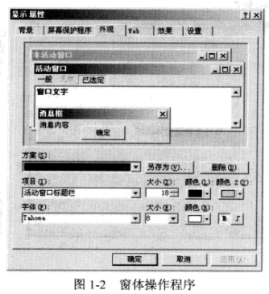
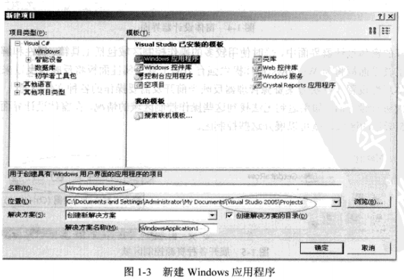

# 第1章 Windows编程基础

**本章内容**

* 课程简介与课程定位
* Windows和窗体的基本概念
* WinForm中的常用控件
* 多文档界面处理（MDI）
* 窗口界面的美化
* 本章小结

## 1.1 课程简介与课程定位

目前，.NET 2.0环境下的软件系统开发越来越受到软件行业和应用企业的青睐。Visual Studio.NET 为不同的应用程序提供了丰富的环境，一个项目本身可以由多种语言开发，如C++、C#、Visual Basic等。系统的应用程序既可以包括控制台应用程序，也可以包括Windows Forms开发，还可以应用与各种的Web平台应用开发设计和手持移动设备等。

本书着重介绍在C#环境下如何构建Windows应用程序开发，扬弃了C#的编程基础和抽象的软件设计思想。如果读者期望尽快进入C# Windows程序设计领域，本书是比较合适的入门级教材。

1.1.1 课程简介

本课程定位于Visual Studio.NET 2005环境下，通过C#语言开发的Windows Forms开发程序设计。本课程的先修课程包括C#程序设计基础、数据库基础理论与应用、数据结构与算法、面向对象的程序设计等，以使学生迅速进入Windows Forms开发环节，并可以设计出符合标准的Windows应用软件。

学习本课程后，学生将掌握以下基本知识点：

* Windows窗体设计界面介绍
* WinForm窗口的基本操作
* 窗体容器以及MDI和SDI应用程序设计
* 消息框窗口对话框机制
* 基本窗体控件的设计开发
* 高级窗体控件的设计开发
* WinForm文件操作的开发设计
* GDI+图形图像编程技术
* 多线程编程技术
* ADO.NET数据库访问技术
* WinForm网络编程技术
* 水晶报表技术
* WinForm中的打包和部署

### 1.1.2 课程体系定位

本门课程绝非孤立穿在的，其课程的开设必须建立在一套课程体系的基础上，具体课程体系如图1-1所示。


如图1-1所示，C# Windows程序设计在整体课程体系中处于承上启下的重要地位。C# Windows程序设计一方面是C#及面向对象程序设计思想的延伸和具体应用，另一方面是熟悉.NET Framework的非常好的手段，同时也为下一阶段的ASP.NET的开发奠定了应用实践基础。因此本课程对于软件技术专业的学生意义重大。

## 1.2 Windows和窗体的基本概念

**学习目标**

* 理解Windows窗体的概念及设计原则
* WinForm应用程序的入口点
* 设置InitalizeComponent()方法
* 灵活运用C# WinForm开发基本环境

### 1.2.1 Windows Forms程序的基本结构

在使用Windows操作系统时，经常会遇到如图1-2所示的窗体操作程序。一般而言，这种操作多是用户在PC机上的独立操作。



下面来建立本书第一个C#环境下的Windows应用程序。启动Visual Studio 2005，默认语言为C#语言，建立如图1-3所示的Windows应用程序。一般而言，用Visual C#开发应用程序包括建立项目、界面设计、属性设计和代码设计几个阶段。



在建立新的应用程序时需定义项目的名称及具体的物理路径位置，单击“确定”按钮后Visual C#将自动创建一个新的默认窗体FORM1，窗体设计器界面如图1-4所示。


在展开的窗体设计器界面中，平时使用较多的操作控制区域包括工具箱、属性和解决方案资源管理器。工具箱面板将为Windows窗体提供强有力的工具，属性面板将反映拖拽过来的Windows控件的具体属性设置，解决方案资源管理器反映当前开发需要操作的各种文件资源。

在首次进行设计时，如果遇到无法找到这些操作控制区域的情况，在窗体设计界面的右上角选择如图1-5所示的区域，就可以展开这些控制区。


### 1.2.2 了解WinForm程序的代码结构

**1. 初始WinForm代码**

在图1-4所示的主要窗体控制区域中右击，在弹出的快捷菜单中选择“查看代码”命令，如图1-6所示，显示后台的C#代码。


展开的代码如下，具体意义可参考每行的注释信息。

```C#
using System;//基础核心命名空间 
using System.Collections.Generic;//包含了ArrayList、BitArray、Hashtable、Stack、StringCollection和StringTable类
using System.ComponentModel;
using System.Data;//数据库访问控制
using System.Drawing;//绘图类
using System.Linq;
using System.Text;//文本类
using System.Threading.Tasks;
using System.Windows.Forms;//大量窗体和控件

namespace WindowsFormsApp1//当前操作的命名空间是WindowsApplication1
{
    public partial class Form1 : Form//从System.Windows.Forms.Form中派生
    {
        public Form1()
        {
            InitializeComponent();//注意该方法在下面的介绍
        }
    }
}

```


> **小知识：理解Using语句**
>
> Using语句通常出现在一个.cs文件的头部，用于定义引用系统命名空间，具体的操作方法和属性等被定义在该系统的命名控件中，比如如果不写using System.Drawing，则无法在后期开发中进行图形图像方面的设计开发。
>
> 另一方面，用户可以在一个用户自定义的命名空间下定义用户自定义类，这样在头部通过Using语句声明该用户自定义的命名空间，从而获取该命名空间下的具体类以及该类的属性和方法，达到对于系统软件分层开发的目的。

**2. 理解InitializeComponent()方法**

在每一个窗体生成的时候，都会针对当前的窗体定义InitializeComponent()方法，该方法实际上是由系统生成的对于窗体界面的定义方法。

```c#
//位于.cs文件中的InitializeComponent()方法
public Form1()
{
    InitializeComponent();//注意该方法在下面的介绍
}
```

在每一个Form文件建立后，都会同时产生程序代码文件（.CS文件）以及与之相匹配的.Designer.CS文件。业务逻辑以及事件方法等被编写在.CS文件中，而界面设计规则被封装在.Designer.CS文件里。下面的代码为.Designer.CS文件的系统自动生成的脚步代码。

```c#
namespace WindowsFormsApp1
{
    partial class Form1
    {
        /// <summary>
        /// 必需的设计器变量。
        /// </summary>
        private System.ComponentModel.IContainer components = null;

        /// <summary>
        /// 清理所有正在使用的资源。
        /// </summary>
        /// <param name="disposing">如果应释放托管资源，为 true；否则为 false。</param>
        protected override void Dispose(bool disposing)
        {
            if (disposing && (components != null))
            {
                components.Dispose();
            }
            base.Dispose(disposing);
        }

        #region Windows 窗体设计器生成的代码

        /// <summary>
        /// 设计器支持所需的方法 - 不要修改
        /// 使用代码编辑器修改此方法的内容。
        /// </summary>
        private void InitializeComponent()
        {
            this.components = new System.ComponentModel.Container();
            this.AutoScaleMode = System.Windows.Forms.AutoScaleMode.Font;
            this.ClientSize = new System.Drawing.Size(800, 450);
            this.Text = "Form1";
        }

        #endregion
    }
}


```

在代码中，可以很容易发现InitializeComponent()方法和Dispose()方法，前者为界面设计的编写内容，后者为表单释放系统资源时的执行编码。

**3. 创建WinForm应用程序的入口点**

在WinForm应用程序的开发设计中，一般会通过多窗体协调一致的处理具体业务流程。这种应用必须由程序员决定哪个WinForm的窗体第一个被触发执行：在Windows Forms开发程序设计中则由位于根目录下的Program.cs文件决定。展开Program.cs文件，按照下面代码即可决定哪个WinForm的表单第一个被触发执行。

