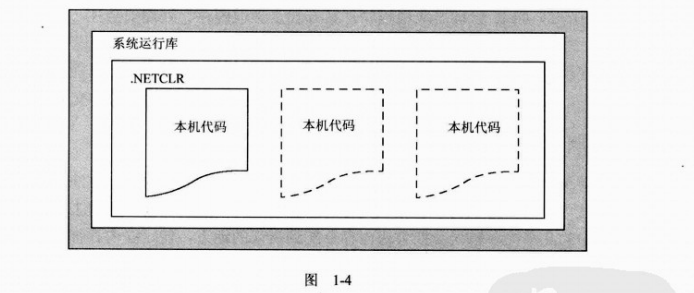

# C#简介

本书的第1部分将介绍使用C#语言所需的基础知识。第1章将概述C# 和.NET Framework、对这些技术的理解、使用它们的原因，以及它们之间的相互关系。

首先讨论一下.NET Framework。这种技术包含的许多概念初看起来都不是很容易掌握的。也就是说，我们必须在很短的时间里介绍许多新概念，但是，快速浏览这些基础知识对于理解如何利用C# 进行编程是非常重要的，本书的后面将详细论述这里提到的许多论题。

之后，本章讨论C# 本身，包括它的起源和与C++ 的类似之处。最后，介绍本书使用的主要工具：Visual Studio 2008（VS）和Visual C# 2008 Express Edition（VCE）。

## 1.1 什么是.NET Framework

.NET Framework 是 Microsoft为开发应用程序而创建的一个富有革命性的新平台。这句话最有趣的地方时它的含糊不清，但这是有原因的。首先，注意这句话没有说“在Windows操作系统上开发应用程序”。尽管.NET Framework的Microsoft版本运行在Windows操作系统上，但以后将推出运行在其他操作系统上的版本，例如Mono，它是.NET Framework的开源代码版本（包含一个C# 编译器），该版本可以运行在几个操作系统上，包括各种Linux版本和Mac OS。许多这类项目正在开发，在读者阅读本书时可能就已发布了。另外，还可以在个人数字助手（PDA）类设备和一些智能电话上使用Microsoft .NET Compact Framework（基本上是完整.NET Framework的一个子集）。使用.NET Framework的一个主要原因是它可以作为集成各种操作系统的方式。

另外，上面给出的.NET Framework定义并没有限制应用程序的类型。这是因为本来就没有限制。.NET Framework可以创建Windows应用程序、Web应用程序、Web服务器和其他各种类型的应用程序。

.NET Framework的设计方式保证它可以用于各种语言，包括本书要介绍的C#语言，以及C++、Visual Basic、JScript，甚至一些旧的语言，如COBOL。为此，还推出了这些语言的.NET版本，目前还在不断推出更多的.NET版本语言。所有这些语言都可以访问.NET Framework，它们还可以彼此交互。C#开发人员可以使用Visual Basic程序员编写的代码，反之亦然。

所有这些提供了意想不到的多样性，这也是.NET Framework具有有人前景的部分原因。

### 1.1.1 .NET Framework的内容

.NET Framework主要包含一个非常大的代码库，可以在客户语言（如C#）中通过面向对象编程技术（OOP）来使用这些代码。这个库分为不同的模块，这样就可以根据希望得到的结果来选择使用其中的各个部分。例如，一个模式包含Windows应用程序的构件，另一个模块包含网络编程的代码块，还有一个模块包含Web开发的代码块。一些模块还分为更具体的子模块，例如，在Web开发模块中，有用于建立Web服务的子模块。

其目的是，不同的操作系统可以根据自己的特性，支持其中的部分或全部模块。例如，PDA支持所有的核心.NET功能，但不需要某些更深奥的模块。

部分.NET Framework库定义了一些基本类型。类型是数据的一种表达方式，指定其中最基础的部分（如32位带符号的整数），以便使用.NET Framework在各种语言之间进行交互操作。这称为通用类型系统（Common Type System，CTS）。

除了支持这个库以外，.NET Framework还包含.NET公共语言运行库（Common Language Runtime，CLR），它负责管理用.NET库开发的所有应用程序的执行。

### 1.1.2 用.NET Framework编写应用程序

使用.NET Framework编写应用程序，就是使用.NET代码库编写代码（使用支持Framework的任何一种语言）。本书用VS和VCE进行开发，VS是一种强大的集成开发环境，支持C#（以及托管和非托管C++、Visual Basic和其他一些语言）。VCE时VS的一个删节版本（免费），仅支持C#。这些环境的优点是便于把.NET功能集成到代码中。我们创建的代码完全时C#代码，但使用了.NET Framework，并在需要时利用了VS和VCE中的其他工具。

**1. MSIL和JIT**

在编译使用.NET Framework库的代码时，不是立即创建操作系统特定的本机代码，而是把代码编译为Microsoft中间语言（Microsoft Intermediate Language，MSIL）代码，这些代码不专用于任何一种操作系统，也不专用于C#。其他.NET语言，如Visual Basic .NET也可以在第一阶段编译为这种语言，开发C#应用程序时，编译过程就由VS或VCE完成。

显然，要执行应用程序，必须完成更多的工作，这是Just-In-Time（JIT）编译器的任务，它MSIL编译为专用于OS和目的机器结构的本机代码。这样OS才能执行应用程序。这里编译器的名称Just-In-Time反映了MSIL仅在需要时才编译的事实。

过去，常常需要把代码编译为几个应用程序，每个应用程序都用于特定的操作系统和CPU结构。这通常是一种优化形式（例如，为了让代码在AMD芯片上运行得更快），但有时是非常重要的（例如，对于工作在Win9x和WinNT/2000环境下的应用程序）。现在就不必要了，因为顾名思义，JIT编译器使用MSIL代码，而MSIL代码时独立于机器、操作系统和CPU的。目前有几种JIT编译器，每种编译器都用于不同的结构，我们总能找到一个合适的编译器创建所需的本机代码。

**3. 托管代码**

在将代码编译为MSIL，再用JIT编译器将它编译为本机代码后，CLR的任务还没有全部完成，还需要管理正在执行的用.NET Framework编写的代码（这个执行代码的阶段通常被称为运行时（runtime））。即CLR管理着应用程序，其方式是管理内存、处理安全性，以及允许运行跨语言调试等。相反，不在CLR控制之下运行的应用程序是非托管的，某些语言如C++可以用于编写这类应用程序，例如，访问操作系统的低级功能。但是，在C#中，只能编写在托管环境下运行的代码。我们将使用CLR的托管功能，让.NET自己与操作系统进行交互。

**4. 垃圾回收**

托管代码最重要的一个功能是垃圾回收（garbage collection）。这种.NET方法可确保应用程序不再使用某些内存时，这些内存就会被完全释放。在.NET推出以前，这项工作主要由程序员负责，代码中的几个简单错误会把大块内存分配到错误的地方，使这些内存神秘失踪。这通常意味着计算机的速度逐渐减慢，最终导致系统崩溃。

.NET垃圾回收会频繁检查计算机内存，从中删除不再需要的内容。它没有设置时间帧，可能一秒钟会进行上千次的检查，也可能几秒钟检查一次，或者随时进行检查，但一定是进行了检查。

这里要给程序员一些提示。因为这项工作在不可预知的时间进行，所以在设计应用程序时，必须记得要进行这样的检查。需要许多内存才能运行的代码应自己执行这样的检查，而不是坐等垃圾回收，但这不像听起来那么难。

**5. 把它们组合在一起**

在继续学习之前，先总结一下上述创建.NET应用程序所需要的步骤：

（1）使用某种.NET兼容语言（如C#）编写应用程序代码，如图1-1所示。

（2）把代码编译为MSIL，存储在程序集中，如图1-2所示。

（3）在执行代码时（如果这是一个可执行文件，就自动运行，或者在其他代码使用它时运行），首先必须使用JIT编译器将代码编译为本机代码，如图1-3所示。

（4）在托管的CLR环境下运行本机代码，以及其他应用程序或进程，如图1-4所示。

**6. 链接**

在上述过程中还有一点要注意。在第(2)步中编译为MSIL的C#代码不一定包含在单独的文件中，可以把应用程序代码放在多个源代码文件中，再把它们编译到一个程序集中。这个过程称为链接，是非常有用的。原因是处理几个较小的文件比处理一个大文件要简单得多。可以把逻辑上相关的代码分解到一个文件中，以便单独处理它，这也更易于在需要代码时找到它们，让开发小组把编程工作分为一些可管理的块，让每个人编写一小块代码，而不会破坏已编写好的代码部分或其他人正在处理的部分。

## 1.2 什么是C#

如上所述，C#是可用于创建要运行在.NET CLR上的应用程序的语言之一，它从C和C++语言演化而来，是Microsoft专门为使用.NET平台而创建的。因为C#是近期发展起来的，所以吸取了以前的教训，考虑了其他语言的许多优点，并解决了它们的问题。

使用C#开发应用程序比使用C++简单，因为其语法比较简单。但是，C#是一种骐达的语言，在C++中能完成的任务利用C#也能完成。如前所述，C#中与C++高级功能等价的功能呢（例如直接访问和处理系统内存），只能在标记为“不安全”的代码中使用。这个高级编程技术是非常危险的（正如它的名称），因为它可能覆盖系统中重要的内存块，导致严重的后果。因此，本书不讨论这个问题。

C#代码常常比C++略长一些。这是因为C#是一种类型安全的语言（与C++不同）。在外行人看来，这表示一旦为某个数据指定了类型，就不能转换为另一个不相关的类型。所以，在类型之间转换时，必须遵守严格的规则。执行相同的任务时，用C#编写的代码通常比C++ 长。但C#代码更健壮，调试也比较简单，.NET总是可以随时跟踪数据的类型。

在C#中，不能完成诸如“把4字节的内存放在这个数据中，使之有10个字节长，并把它解释为X“等的任务，但这并不是一件坏事。

C#只是用于.NET开发的一种语言，但它是最好的一种语言。C#的优点是，它是唯一为.NET Framework设计的语言，是在移值到其他操作系统上的.NET版本中使用的主要语言。要使语言如VB.NET尽可能类似于其以前的语言，且仍遵循CLR，就不能完全支持.NET代码库的某些功能。但C#能使用.NET Framework代码库提供的每种功能。.NET的最新版本还对C#语言进行了几处改进，满足了开发人员的要求，使之更强大。

### 1.2.1 用C#能编写什么样的应用程序

如前所述，.NET Framework没有限制应用程序的类型。C#使用的是.NET Framework，所以也没有限制应用程序的类型。这里仅讨论几种常见的应用程序类型。

* **Windows应用程序** 这些应用程序（如Microsoft Office）具有我们很熟悉的Windows外观和操作方式，使用.NET Framework的Windows Forms模块就可以生成这种应用程序。Windows Form模块是一个控件库，其中的控件（例如，按钮、工具栏、菜单等）可以用于建立Windows用户界面（UI）。
* **Web应用程序** 它们是一些Web页面，可以通过任何Web浏览器查看。.NET Framework包含一个动态生成Web内容的强大系统，允许个性化、实现安全性等。这个系统叫作Active Server Pages .NET（ASP.NET)，我们可以使用C#通过Web Forms创建ASP.NET应用程序。
* **Web服务** 这是创建各种分布式应用程序的新方式，使用Web服务可以通过Internet虚拟交换数据。无论使用什么语言创建Web服务，也无论Web服务驻留在什么系统上，都使用一样简单的语法。

这些类型也需要某种形式的数据库访问，这可以通过.NET Framework 的Active Data Objects .NET（ADO.NET）部分或C#的LINQ新功能来实现。也可以使用许多其他资源，例如，创建联网组件、输出图形、执行复杂数学任务的工具。

### 1.2.2 本书中的C#

本书的第Ⅰ部分介绍了C#语言的语法和用法，但不过分强调.NET Framework。这是必需的，因为我们不能没有一点儿C#编程基础就使用.NET Framework。首先介绍一些比较简单的内容，把面向对象编程（Object-Oriented Programming，OOP）的问题放在基础知识的后面论述。假定读者没有一点儿编程的知识，这些是首要的规则。

学习了基础知识后，本书还将介绍如何开发上一节列出的应用程序类型。本书的第Ⅱ部分将讨论Windows Forms编程，第Ⅲ部分将研究Web应用程序和Web服务编程，第Ⅳ部分将讲述数据访问（对数据库、文件系统和XML数据的访问），第Ⅴ部分将介绍其他有趣的.NET论题（例如，程序集和图形编程）。

## 1.3 Visual Studio 2008

本书使用Visual Studio 2008（VS）或Visual C# 2008 Express Edition（VCE）进行所有的C#编程，包括简单的命令行应用程序，以及比较复杂的项目类型。VS不是开发C#应用程序所必需的开发工具或集成开发环境（IDE），但使用它可以使任务更简单一些。可以在基本的文本编辑器（如常见的Notepad）中处理C#源代码文件，再使用命令行应用程序（是.NET Framework的一部分）把代码编译到程序集中。但是，为什么要使用功能全面的IDE呢？

下面列出的是一些使VS成为.NET开发首选工具的功能。

* VS可以自动执行编译源代码的步骤，同时可以完全控制重写它们时应使用的任何选项。
* VS文本编辑器可以配合VS支持的语言（包括C#），这样就可以智能检测错误，在输入代码时给出合适的推荐代码，这个功能称为IntelliSense。
* VS包括Windows Forms和Web Forms设计器，允许UI元素的简单拖放设计。
* 在C#中，许多类型的项目都可以用已有的“模版”代码来创建，不需要从头开始。各种代码文件通常已经为我们准备好了，减少了从头开始一个项目所花的时间。对于新的“Starter Kit”项目类型来说尤其如此，该项目类型可以以功能全面的应用程序为基础进行开发。一些Starter Kit项目类型包含在VS安装程序中，还可以在线使用更多的该项目类型。
* VS包括几个可自动执行常见任务的向导，它们可以在已有的文件中添加合适的代码，而不需要考虑（在某些情况下）语法的正确性。
* VS包含许多强大的工具，可以显示和导航项目中的元素，这些元素可以是C#源文件代码，也可以是其他资源，例如，位图图像或声音文件。
* 除了在VS中编写应用程序比较简单外，还可以创建部署项目，以易于为客户提供代码，并方便地安装该项目。
* 在开发项目时，VS可以使用高级调试技巧，例如，能一次调试一行指令，并监视应用程序的状态。

C#还有许多功能，希望读者能掌握它们！

### 1.3.1 Visual Studio 2008 Express产品

除了Visual Studio 2008之外，Microsoft还提供了几个更简单的开发工具，称为Visual Studio 2008 Express产品。它可以在http://lab.msdn.microsoft.com/express 上免费获得。

其中两个产品是Visual C# 2008 Express 和Visual Web Developer 2008 Express，它们都可以创建几乎所有的C#应用程序。在功能上它们都是Vs的删节版本，但外观和操作方式是一样的。尽管它们提供了VS的许多功能，但缺少一些重要的功能，只是我们仍可以在学习本书的过程中使用它们。

本书尽可能使用VCE开发C#应用程序，仅在需要某些功能时才使用VS。

### 1.3.2 解决方案

在使用VS或VCE开发应用程序时，可以通过创建解决方案来完成。在VS和VCE术语中，解决方案不仅仅是一个应用程序，它还包含项目，可以是Windows Forms项目、Web Form项目等。但是，解决方案可以包含多个项目，这样，即使相关的代码最终在硬盘上的多个位置编译为多个程序集，也可以把它们组合到一个地方。

这是非常有用的，因为它可以处理“共享”代码（这些代码放在GAC中），同时，应用程序也使用这段共享代码。在使用唯一的开发环境时，调试代码是非常容易的，因为可以在多个代码块中单步调试指令。

## 1.4 小结

本章简要介绍了.NET Framework，并讨论了如何轻松地创建各种强大的应用程序。还探讨把C#等语言编写的代码转换为可运行的应用程序所需要做的工作，以及使用在.NET Common Language Runtime下运行的托管代码有什么优点。

本章还阐述了C#的实质，以及它与.NET Framework的关系，描述了进行C#开发时所使用的工具——Visual Studio 2008和Visual C# 2008 Express。

本章学习了：

* 什么是.NET Framework，为什么创建它，有哪些因素吸引我们在这个环境中编程
* 什么是C#，为什么它是在.NET Framework中编程的理想工具
* 高效开发.NET应用程序需要什么，即像VS或VCE这样的开发环境

第2章将介绍如何运行C#代码，介绍基础知识，并集中讨论C#语言本身，而不是过多地讨论IDE的工作原理。

