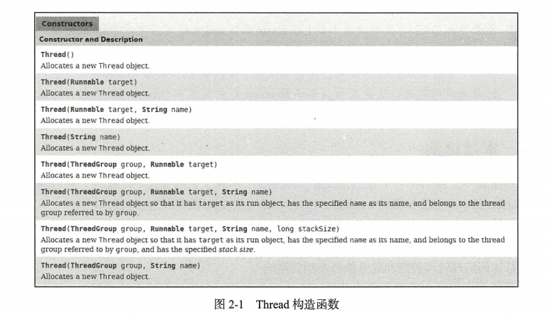

# 第2章 深入理解Thread构造函数

Java中的Thread为我们提供了比较丰富的构造函数，在本章中，我们将会逐一介绍每一个构造函数，以及分析其中一些可能并未引起你关注的细节。Thread构造函数如图2-1所示。



## 2.1 线程的命名

在构造线程的时候可以为线程起一个有特殊意义的名字，这也是比较好的一种做法，尤其在一个线程比较多的程序中，为线程赋予一个包含特殊意义的名字有助于问题的排查和线程的跟踪，因此笔者强烈推荐在构造线程的时候赋予它一个名字。

### 2.1.1 线程的默认命名

下面的几个构造函数中，并没有提供为线程命名的参数，那么此时线程会有一个怎样的命名呢？

* Thread()
* Thread(Runnable target)
* Thread(ThreadGroup group, Runnable target)

打开JDK的源码会看到下面的代码：

```java
public Thread(Runnable target) {
    init(null, target, "Thread-" + nextThreadNum(), 0);
}
/* For autonumbering anonymous threads. */
private static int threadInitNumber;
private static synchronized int nextThreadNum() {
    return threadInitNumber++;
}	
```

如果没有为线程显式地指定一个名字，那么线程将会以“Thread-”作为前缀与一个自增的数字进行组合，这个自增数字在整个JVM进程中将会不断自增：

```java
import java.util.stream.IntStream;

/**
 * ThreadInitNumberCheck
 *
 * @author shenhuanjie
 * @date 2019/7/26 10:55
 */
public class ThreadInitNumberCheck {
    public static void main(String[] args) {
        IntStream.range(0, 5).boxed().map(i -> new Thread(
                () -> System.out.println(Thread.currentThread().getName()))
        ).forEach(Thread::start);
    }
}

```

执行上面的代码，这里使用无参的构造函数创建了5个线程，并且分别输出了各自的名字，会发现输出结果与我们对源码的分析是一致的，输出如下：

```
Thread-0
Thread-1
Thread-2
Thread-3
Thread-4
```

### 2.1.2 命名线程

在2.1.1中，笔者强烈推荐在构造Thread的时候，为线程赋予一个特殊的名字是一种比较好的实战方式，Thread同样也提供了这样的构造函数，具体如下。

* Thread（String name)
* Thread（ThreadGroup group，Runnable target，String name）
* Thread（ThreadGroup group，Runnable target，String name，long stackSize）
* Thread（ThreadGroup group，String name）

示例代码如下：

```java
import java.util.stream.IntStream;

/**
 * ThreadName
 *
 * @author shenhuanjie
 * @date 2019/7/26 11:14
 */
public class ThreadConstruction {
    private final static String PREFIX = "ALEX-";

    public static void main(String[] args) {
        IntStream.range(0, 5).mapToObj(ThreadConstruction::createThread).forEach(Thread::start);
    }

    private static Thread createThread(final int intName) {
        return new Thread(
                () -> System.out.println(Thread.currentThread().getName())
                , PREFIX + intName);
    }
}
```

在上面的代码中，我们定义了一个新的前缀“ALEX-”，然后用0~4之间的数字作为后缀对线程进行了命名，代码执行输出的结果如下所示：

```
ALEX-1
ALEX-0
ALEX-2
ALEX-3
ALEX-4
```

### 2.1.3 修改线程的名字

不论你使用的是默认的函数命名规则，还是指定了一个特殊的名字，在线程启动之前还有一个机会可以对其进行修改，一旦线程启动，名字将不再被修改，下面是Thread的setName源码：

```java
public final synchronized void setName(String name) {
    checkAccess();
    if (name == null) {
        throw new NullPointerException("name cannot be null");
    }

    this.name = name;
    if (threadStatus != 0) { // 线程不是NEW状态，对其的修改将不会生效
        setNativeName(name);
    }
}
```

## 2.2 线程的父子关系

Thread的所有构造函数，最终都会去调用一个静态方法init，我们截取片段代码对其进行分析，不难发现新创建的任何一个线程都会有一个父线程：

```java
private void init(ThreadGroup g, Runnable target, String name,
                  long stackSize, AccessControlContext acc,
                  boolean inheritThreadLocals) {
    if (name == null) {
        throw new NullPointerException("name cannot be null");
    }

    this.name = name;

    Thread parent = currentThread(); // 获取当前线程作为父线程
    SecurityManager security = System.getSecurityManager();
    ...
}
```

上面代码中的currentThread( )是获取当前线程，在线程生命周期中，我们说过线程的最初状态为NEW，没有执行start方法之前，它只能算是一个Thread的实例，并不意味着一个新的线程被创建，因此currentThread( )代表的将会是创建它的那个线程，因此我们可以得出以下结论。

* 一个线程的创建肯定是由另一个线程完成的。
* 被创建线程的父线程是创建它的线程。

我们都知道main函数所在的线程是由JVM创建的，也就是main线程，那就意味着我们前面创建的所有线程，其父线程都是main线程。

## 2.3 Thread与ThreadGroup

在Thread的构造函数中，可以显式地指定线程的Group，也就是ThreadGroup（关于ThreadGroup会在后面的章节中做重点介绍）。

接着往下阅读Thead init方法的源码：

```java
SecurityManager security = System.getSecurityManager();
if (g == null) {
    /* Determine if it's an applet or not */

    /* If there is a security manager, ask the security manager
               what to do. */
    if (security != null) {
        g = security.getThreadGroup();
    }

    /* If the security doesn't have a strong opinion of the matter
               use the parent thread group. */
    if (g == null) {
        g = parent.getThreadGroup();
    }
}
```

通过对源码进行分析，我们可以看出，如果在构造Thread的时候没有显示地指定一个ThreadGroup，那么子线程将会被加入父线程所在的线程组，下面写一个简单的代码来测试一下，如代码清单2-1所示。

```java
package com.shenhuanjie.thread;

/**
 * ThreadConstruction
 *
 * @author shenhuanjie
 * @date 2019/7/26 11:14
 */
public class ThreadConstruction {
    public static void main(String[] args) {
        Thread t1 = new Thread("t1");

        ThreadGroup group = new ThreadGroup("TestGroup");

        Thread t2 = new Thread(group, "t2");

        ThreadGroup mainThreadGroup = Thread.currentThread().getThreadGroup();

        System.out.println("Main thread belong group: "
                + mainThreadGroup);
        System.out.println("t1 and main belong the same group: "
                + (mainThreadGroup == t1.getThreadGroup()));
        System.out.println("t2 thread group not belong main group: "
                + (mainThreadGroup == t2.getThreadGroup()));
        System.out.println("t2 thread group  belong main TestGroup: "
                + (group == t2.getThreadGroup()));
    }
}

```

注释①创建了一个Thread t1，注释②创建了一个Thread Group，注释③创建了一个Thread t2，并且将它加入到了group中，我们并没有给t1指定任何Group，执行上面的代码，输出结果为：

```
Main thread belong group: java.lang.ThreadGroup[name=main,maxpri=10]
t1 and main belong the same group: true
t2 thread group not belong main group: false
t2 thread group  belong main TestGroup: true
```

通过对Thread源码的分析和我们自己的测试可以得出以下结论。

* main线程所在的ThreadGroup成为main。
* 构造一个线程的时候如果没有显式地指定ThreadGroup，那么它将会和父线程同属一个ThreadGroup。

在默认设置中，当然除了子线程会和父线程同属于一个Group之外，它还会和父线程拥有同样的优先级，同样的daemon，关于这点我们在后文中将会详细讲解。

## 2.4 Thread与Runnable

在本书的第1章中，详细介绍了为什么要有Runnable，以及Runnable接口和Thread之间的关系，Thread负责线程本身相关的职责和控制，而Runnable则负责逻辑执行单元的部分，这里就不再赘述了。

## 2.5 Thread与JVM虚拟机栈

在Thread的构造函数中，可发现有一个特殊的参数stackSize，这个参数的作用是什么呢？它的值对线程有什么影响呢？下面我们就来一起探讨这个问题。

### 2.5.1 Thread与StackSize

打开JDK官方文档，将会发现Thread中对stacksize构造函数的文字说明，具体如下：

> The stack size is the approximate number of bytes of address space that the virtual machine is to allocate for this thread's stack. The effect of the stackSize parameter, if any, is highly platform dependent.
>
> One some platforms , specifying a higher value for the stackSize parameter may allow a thread to achieve greater recursion depth before throwing a StackOverflowError. Similarly , specifying a lower value may allow a greater number of threads to exist concurrently without throwing an OutOfMemoryError ( or other internal error ) . The details of the relationship between the value of the stackSize parameter and the maximum recursion depth and concurrency level are platform-dependent. On some platforms, the value of the stackSize parameter may have no effect whatsoever.

一般情况下，创建线程的时候不会手动指定栈内存的地址空间字节数组，统一通过xss参数进行设置即可，通过上面这段官网文档的描述，我们不难发现stacksize越大则代表则正在线程内方法调用递归的深度就越深，stacksize越小则代表则创建的线程数量越多，当然了这个参数对平台的依赖性比较高，比如不同的操作系统、不同的硬件。

在有些平台下，越高的stack设定，可以允许的递归深度越多；反之，越少的stack设定，则递归深度越浅。当然在某些平台下，该参数压根不会起到任何作用，如果将该参数设置为0，也不会起到任何作用，笔者在自己的Windows电脑上和Ubuntu虚拟机上分别作了测试，很明显地看到了stacksize给线程带来的影响。

```java
/**
 * ThreadConstruction
 *
 * @author shenhuanjie
 * @date 2019/7/26 11:14
 */
public class ThreadConstruction {
    public static void main(String[] args) {
        if (args.length < 1) {
            System.out.println("Please enter the stack size.");
            System.exit(1);
        }

        ThreadGroup group = new ThreadGroup("TestGroup");
        Runnable runnable = new Runnable() {
            final int MAX = Integer.MAX_VALUE;

            @Override
            public void run() {
                int i = 0;
                recurse(i);
            }

            private void recurse(int i) {
                System.out.println(i);
                if (i < MAX) {
                    recurse(i + 1);
                }
            }
        };

        Thread thread = new Thread(group, runnable, "Test", Integer.parseInt(args[0]));

        thread.start();
    }
}

```

在代码清单2-2中，我们在线程中，设定了一个简单的递归，就是不断调用自己，然后输出int值，为了使得效果更加明显，在运行上面的代码过程中请指定JVM内存参数为：

```
java -Xmx512m -Xms64m ThreadConstruction 1
```

由于不断地进行压栈弹栈操作，整个内存肯定会被压爆，也就是说最后都会抛出StackOverflowError异常，笔者分别在Windows 7和Ubuntu环境下进行了多次测试