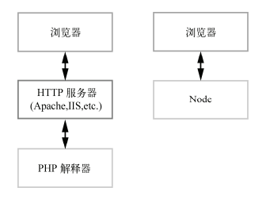

# 第3章 Node.js快速入门

Node.js是一个方兴未艾的技术。一直以来，关于Node.js的宣传往往针对它“与众不同”的特性，这使得它显得格外扑朔迷离。事实上，Node.js的绝大部分特性跟大多数语言一样都是旧瓶装新酒，只是一些激进的特性使它显得很神秘。在这一章中，我们将会讲述Node.js的种种特性，让你对Node.js本身以及如何使用Node.js编程有一个全局性了解，主要内容有：

* 编写第一个Node.js程序；
* 异步式I/O和事件循环；
* 模块和包；
* 调试；

让我们开始这个激动人心的旅程吧。

## 3.1 开始用Node.js编程

Node.js 具有深厚的开源血统，它诞生于托管了许多优秀开源项目的网站——GitHub。和大多数开源软件一样。它由一个黑客发起，然后吸引了一小拨爱好者参与贡献代码。一开始它默默无闻，靠口口相传扩散，直到某一天被一个黑客媒体曝光，进入业界视野，随后便有一些有远见的公司提供商业支持，使其逐步发展壮大。

用Node.js编程是一件令人愉快的事情，因为你将开始用黑客的思维和风格编写代码。你会发现像这样的语言很容易入门，可以快速了解到它的细节，然后掌握它。

### 3.1.1 Hello World

好了，让我们开始实现第一个Node.js程序吧。打开你常用的文本编辑器，在其中输入：

```javascript
console.log('Hello World');
```

将文件保存为helloworld.js，打开终端，进入helloworld.js所在的目录，执行以下命令：

```bash
node helloworld.js
```

如果一切正常，你将会在终端中看到输出Hello World。很简单吧？下面让我们来解释一下这个程序的细节。console是Node.js提供的控制台对象，其中包含了向标准输出写入的操作，如console.log、console.error等。console.log是我们最常用的输出指令，它和C语言中的printf的功能类似，也可以接受多个参数。

……

### 3.1.3 建立HTTP服务器

前面的Hello World程序对于你来说可能太简单了，因为这个例子几乎可以在任何语言的教科书上找到对应的内容，既无聊又乏味，让我们来点儿不一样的东西，真正感受一下Node.js的魅力所在吧。

Node.js是为网络而诞生的平台，但又与ASP、PHP有很大的不同，究竟不同在哪里呢？如果你有PHP开发经验，会知道在成功运行PHP之前想要配置一个功能强大而复杂的HTTP服务器，譬如Apache、IIS或Nginx，还需要将PHP配置为HTTP服务器的模块，或者使用FastCGI协议调用PHP解释器。这种架构是“浏览器-HTTP服务器-PHP解释器”的组织方式，而Node.js采用了一种不同的方式，如图3-1所示。



我们看到，Node.js将“HTTP服务器”这一层抽离，直接面向刘浏览器用户。这种架构从某种意义上来说是颠覆性的，因而会让人心存疑虑：Node.js作为HTTP服务器的效率足够吗？会不会提高耦合程度？我们不打算在这里讨论这种架构的利弊，后面章节会继续说明。

好了，回归正题，让我们创建一个HTTP服务器吧。建立一个名为app.js的文件，内容为：

```js
// app.js

let http = require('http');

http.createServer(function (req, res) {
    res.writeHead(200, {
        'Content-Type': 'text/html'
    });
    res.write('<h1>Node.js</h1>');
    res.end('<p>Hello World</p>');
}).listen(3000);

console.log('HTTP server is listening at port 3000. http://localhost:3000/');
```

接下来运行`node app.js`命令，打开浏览器访问`http://localhost:3000/`即可看到图3-2所示的内容。


用Node.js实现的最简单的HTTP服务器就这样诞生了。这个程序调用了Node.js提供的http模块，对所有HTTP请求答复同样的内容并监听3000端口。在终端中运行这个脚本时，我们会发现它并不像Hello World一样结束后立即退出，而是一直等待，直到按下`Ctrl+C`才会结束。这是因为`listen`函数中创建了事件监听器，使得Node.js进程不会退出事件循环。我们会在后面的章节中详细介绍这其中的奥秘。

……

## 3.2 异步式I/O与事件式编程

Node.js最大的特点就是异步式I/O（或者非阻塞I/O）与事件紧密结合的编程模式。这种模式与传统的同步式I/O线性的编程思路有很大的不同，因为控制流很大程度上要靠事件和回调函数来组织，一个逻辑要拆分为若干个单元。

### 3.2.1 阻塞与线程

什么是阻塞（block）呢？线程在操作中如果遇到磁盘读写或网络通信（统称为I/O操作），通常要耗费较长的时间，这时操作系统会剥夺这个线程的CPU控制权，使其暂停执行，同时将资源让给其他的工作线程，这种线程调度方式称为阻塞。当I/O操作完毕时，操作系统将这个线程的阻塞状态解除，恢复其对CPU的控制权，令其继续执行。这种I/O模式就是通常的同步式I/O（Synchronous I/O）或阻塞式I/O（Blocking I/O）。

相应地，异步式I/O（Asynchronous I/O）或非阻塞式I/O（Non-blocking I/O）则针对所有I/O操作不采用阻塞的策略。当线程遇到I/O操作时，不会以阻塞的方式等待I/O操作的完成或数据的返回，而只是将I/O请求发送给操作系统，继续执行下一条语句。当操作系统完成I/O操作时，以事件的形式通知执行I/O操作的线程，线程会在特定时候处理这个事件。为了处理异步I/O，线程必须有事件循环，不断地检查有没有未处理的事件，依次予以处理。

阻塞模式下，一个线程只能处理一项任务，要想提高吞吐量必须通过多线程。而非阻塞模式下，一个线程永远在执行计算操作，这个线程所使用的CPU核心利用率永远是100%，I/O以事件的方式通知。在阻塞模式下，多线程往往能提高系统吞吐量，因为一个线程阻塞时还有其他线程在工作，多线程可以让CPU资源不被阻塞中的线程浪费。而在非阻塞模式下，线程不会被I/O阻塞，永远在利用CPU。多线程带来的好处仅仅是在多核CPU的情况下利用更多的核，而Node.js的单线程也能带来同样的好处。这就是为什么Node.js使用了单线程、非阻塞的事件编程模式。

图3-3和图3-4分别是多线程同步式I/O与单线程异步式I/O的示例。假设我们有一项工作，可以分为两个计算部分和一个I/O部分，I/O部分占的时间比计算多得多（通常都是这样）。如果我们使用阻塞I/O，那么要想获得高并发就必须开启多个线程。而使用异步式I/O时，单线程即可胜任。


单线程事件驱动的异步式I/O比传统的多线程阻塞式I/O究竟好在哪里呢？简而言之，异步式I/O就是少了多线程的开销。对操作系统来说，创建一个线程的代价是十分昂贵的，需要给它分配内存、列入调度，同时在线程切换的时候还要执行内存换页，CPU的缓存被清空，切换回来的时候还要重新从内存中读取信息，破坏了数据的局限性。

当然，异步式编程的缺点在于不符合人们一般的程序设计思维，容易让控制流变得晦涩难懂，给编码和调试都带来不小的困难。习惯传统编程模式的开发者在刚刚接触到大规模的异步式应用时往往会无所适从，但慢慢习惯以后会好很多。尽管如此，异步式编程还是较为困难，不过可喜的是现在已经有了不少专门解决异步式编程问题的库（如async），参见6.2.2节。

表3-1比较了同步式I/O和异步式I/O的特点。

|         同步式I/O（阻塞式）         | 异步式I/O（非阻塞式）     |
| :---------------------------------: | ------------------------- |
|        利用多线程提供吞吐量         | 单线程即可实现高吞吐量    |
| 通过事件片分隔和线程调度利用多核CPU | 通过功能划分利用多核CPU   |
| 需要由操作系统调度多线程使用多核CPU | 可以将单进程绑定到单核CPU |
|         难以充分利用CPU资源         | 可以充分利用CPU资源       |
|      内存轨迹大，数据局部性弱       | 内存轨迹小，数据局部性强  |
|         符合线性的编程思维          | 不符合传统编程思维        |

### 3.2.2 回调函数

让我们看看在Node.js中如何用异步的方式读取一个文件，下面是一个例子：

```js
// readfile.js

let fs = require('fs');
fs.readFile('file.txt', 'utf-8', function (err, data) {
    if (err) {
        console.error(err);
    } else {
        console.log(data);
    }
});
console.log('end.');
```

运行的结果如下：

```bash
end.
Hello World;
Contents of the file.
```

Node.js也提供了同步读取文件的API：

```js
// readfilesync.js
let fs = require('fs');
let data = fs.readFileSync('file.txt', 'utf-8');
console.log(data);
console.log('end.');
```

运行的结果与前面不同，如下所示：

```bash
end.
Hello World;
Contents of the file.
```

同步式读取文件的方式比较容易理解，将文件名作为参数传入fs.readFileSync函数，阻塞等待读取完成后，将文件的内容作为函数的返回值赋给data变量，接下来控制台输出data的值，最后输出`end.`。

