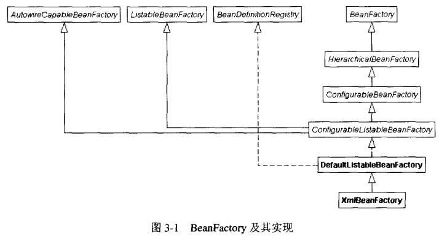
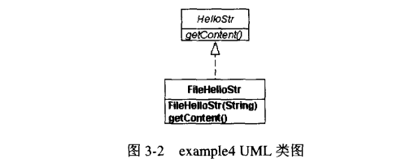
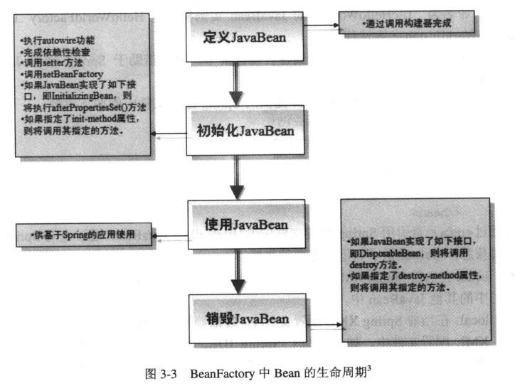

# 第3章 控制反转（Spring IoC）

多年前，GoF在《Design Patterns：Elements of Reusable Object-Oriented Software》一书中提出“Programming to an Interface，not an Implementation”，即“针对接口编程，而不是实现“。通常情况下，开发者都会将业务对象抽象成Java接口，然后将各个业务对象共性的内容实现为Java接口的抽象类，并继承于Java接口。继而，再依据具体的业务操作类型，实现业务对象，并继承于抽象类。其中的含义很明显：子类只能够添加或重载操作，而不能够隐藏父类的操作。最终，实现了抽象类的具体业务实现类便能够响应抽象类继承的接口发送的请求操作。

“针对接口编程，而不是实现“，这是开发者普遍达成的共识。GoF基于”针对接口编程，而不是实现“，实现了许多设计模式。当然，这些具体模式的阐述并不是本书的重点。

在实际应用系统或者产品开发中，如何实施“针对接口编程”而不是实现“呢？比如，在实际产品部署后，如果需要更换使用的业务对象，但又不能够修改源代码。现有的解决办法有很多，比如Service Locator和IoC模式。其中，借助于IoC模式实施”针对接口编程，而不是实现”是本书推荐的办法，而Spring IoC容器正是本章研究的重点。

## 3.1 IoC背景知识。

IoC设计模式，重点关注组件的依赖性、配置以及生命周期。当然，IoC也适用于简单类，而不只是组件。除了具有“Dependency Injection”（即依赖注入）的昵称外，IoC还有另一个称呼，即Hollywood原则（“Don't call me，I'll call you”，即请不要调用我，我将调用你）。通常，应用代码需要告知容器或框架，让它们找到自身所需要的类，然后再由应用代码创建待使用的对象实例。因此，应用代码在使用实例之前，需要创建对象实例。然而，IoC将创建对象实例的任务交给IoC容器或框架（注，实现了IoC设计模式的框架，有时候也称之为IoC容器），使得应用代码只需直接使用实例，这就是IoC。

至于IoC类型， 本书已经在第1章给出过。使用IoC，能够提供如下几方面的优势：

* 应用组件不需要在运行时寻找其协作者，因此更易于开发和编写应用。在许多IoC容器中，借助于设值方法能够在运行时将组件依赖的其他组件注入进来。比如，IoC容器中组件对JNDI的查找工作。
* 由于借助了IoC容器管理组件的依赖关系，使得应用的单元测试和集成测试更利于展开。
* 通常，在借助于IoC容器管理业务对象的前提下，很少需要使用具体IoC容器提供的API。这使得集成现有的遗留应用成为可能。

因此，通过使用IoC能够降低组件之间的耦合度。最终，能够提高类的重用性，更利于测试，而且这个产品或系统更利于集成和配置。

从目前来看，存在许多IoC容器。主要如下：

* Spring
* PicoContainer
* Apache HiveMind

其中，Spring除了提供IoC容器外，还未开发Java/J2EE应用提供了其他大量功能，比如Spring AOP、Spring MVC Framework、集成各种O/R Mapping技术、集成各种视图技术、提供DAO支持、提供事务管理框架、基于Spring构建的Acegi安全框架等。这些功能使得在Open Source社区和开发者社区，Spring比其他IoC容器更为流行和实用。

## 3.2 Spring IoC

Spring IoC容器实现了IoC设计模式。本章并不关注Spring IoC容器的具体实现细节，而是重点关注如何访问和使用Spring IoC容器。

为实现对Spring IoC容器的访问，应用代码可以通过如下两个接口完成。

* BeanFactory：位于org.springframework.beans.factory包中。开发者借助于配置文件（比如，XML或属性文件），能够实现对JavaBean的配置和管理。主要用于开发Java应用，尤其是在物理资源（内存有限）受限的场合，比如Applet应用。
* ApplicationContext：位于org.springframework.context包中。ApplicationContext构建在BeanFactory基础之上，即继承于它。除了具有BeanFactory的功能之外，它还添加了其他大量功能，比如同Spring IoC集成、（为实现国际化而）处理消息资源、（为应用对象发布和注册通知事件而）添加了事件、声明（非）容器提供的服务等。主要用于J2EE应用，这也是Spring推荐使用的接口。

本章将分两部分深入研究BeanFactory和ApplicationContext相关内容。

### 3.2.1 BeanFactory

Spring BeanFactory是非常轻量的，它处于Spring框架的核心。开发者可以将它用于Applet应用和单独的Swing/SWT应用中，因此开发者需要对BeanFactory有足够的了解。当然，对于EJB应用而言也同样合适。在整个Spring框架中都存在BeanFactory的概念，即统一使用BeanFactory访问Spring IoC容器。开发者通过BeanFactory能够定义和提供良好的业务对象层，从技术架构的角度考虑，这是很合理的。

当应用创建BeanFactory实例时，实际上是完成了JavaBean的实例化、配置以及管理，即BeanFactory在访问和操作IoC容器的初期充当了IoC容器的作用。其中，BeanFactory具体使用的Spring配置文件定义了各个JavaBean之间的关系。

Spring提供了org.springframework.beans.factory.BeanFactory接口的若干实现，比如XmlBeanFactory。图3-1给出了BeanFactory及其实现。



对于应用需要直接实例化BeanFactory实例的场合而言，XmlBeanFactory使用尤为广泛。让我们再次回到example4吧。为便于阅读本书，在此再一次给出applicationContext.xml和HelloWorldClient客户应用。

首先，看看applicationContext.xml文件。

```xml
<?xml version="1.0" encoding="UTF-8"?>

<!DOCTYPE beans PUBLIC "-//SPRING//DTD BEAN//EN"
        "http://www.springframework.org/dtd/spring-beans.dtd">
<beans>
    <bean name="fileHelloWorld"
          class="com.openv.spring.HelloWorld">
        <constructor-arg>
            <ref bean="fileHello"/>
        </constructor-arg>
    </bean>

    <bean name="fileHello"
          class="com.openv.spring.FileHelloStr">
        <constructor-arg>
            <value>helloWorld.properties</value>
        </constructor-arg>
    </bean>
</beans>
```

开发者是否注意到其中的粗斜体内容。Spring配置文件（applicationContext.xml）必须遵循spring-beans.dtd定义的内容模型。其中，spring-beans.dtd为JavaBean命名空间提供了一种简单、一致的定义方式，供BeanFactory配置使用。大部分Spring框架提供的功能都需要使用到它，包括基于BeanFactory的Web应用上下文。本书附录B详细给出了spring-beans.dtd的内容模型。

其次，再次回顾一下example4中使用到的各个接口和类，图3-2所示给出了UML类图。



第三，让我们仔细研究HelloWorldClient.java源文件（完整的内容请参考第1章）。

```java
package com.openv.spring;

import org.apache.commons.logging.Log;
import org.apache.commons.logging.LogFactory;
import org.springframework.beans.factory.BeanFactory;
import org.springframework.beans.factory.xml.XmlBeanFactory;
import org.springframework.core.io.ClassPathResource;
import org.springframework.core.io.Resource;

/**
 * HelloWorld客户应用
 *
 * @author shenhuanjie
 * @date 2019/6/5 11:16
 */
public class HelloWorldClient {
    protected static final Log log = LogFactory.getLog(HelloWorld.class);

    public HelloWorldClient() {
        Resource resource = new ClassPathResource("applicationContext.xml");
        BeanFactory factory = new XmlBeanFactory(resource);
        HelloWorld hw = (HelloWorld) factory.getBean("fileHelloWorld");
        log.info(hw.getContent());
    }

    public static void main(String[] args) {
        new HelloWorldClient();
    }
}
```

请开发者注意粗体部分的内容。为配置Spring appcontext.xml文件，开发者需要告知XmlBeanFactory构建器，即appcontext.xml文件。当然，上述客户应用使用了Spring框架中org.springframework.core.io提供的使用类，另外还存在两种方式。

其一，基于文件找到appcontext.xml。示例代码如下：

```java

```

其二，基于ApplicationContext实现类找到applicationContext.xml文件。实例代码如下：

```java
package com.openv.spring;

import org.apache.commons.logging.Log;
import org.apache.commons.logging.LogFactory;
import org.springframework.beans.factory.BeanFactory;
import org.springframework.context.support.ClassPathXmlApplicationContext;


/**
 * HelloWorld客户应用
 *
 * @author shenhuanjie
 * @date 2019/6/5 11:16
 */
public class HelloWorldClient {
    protected static final Log log = LogFactory.getLog(HelloWorld.class);

    public HelloWorldClient() {
//        Resource resource = new ClassPathResource("applicationContext.xml");
        ClassPathXmlApplicationContext applicationContext = new ClassPathXmlApplicationContext(new String[]{"applicationContext.xml"});
        BeanFactory factory = (BeanFactory) applicationContext;
        HelloWorld hw = (HelloWorld) factory.getBean("fileHelloWorld");
        log.info(hw.getContent());
    }

    public static void main(String[] args) {
        new HelloWorldClient();
    }
}

```

在多数场景中，应用并不需要显式地给出实例化BeanFactory实例的代码，因为Spring框架完成了这部分工作，这也体现了Spring框架使用性的一面。比如，对于Web应用而言，当J2EE Web应用部署并启动时，Spring ApplicationContext将会自动被实例化，本书后续内容将会涉及到相关内容。

为获得appcontext.xml中定义的JavaBean，应用代码只需要调用BeanFactory的getBean方法，并造型为JavaBean所属类型，进而对JavaBean对象进行操作。

至此，example4的详细阐述结束。

接下来，本节将继续展开对BeanFactory相关内容的研究。

#### 1. Bean的生命周期

本节将重点研究一下BeanFactory中Bean的声明周期。借助于IoC容器，即通过BeanFactory能够实现对JavaBean的控制反转。IoC容器定义了Spring配置文件中JavaBean应遵循的规则。Spring将其称之为BeanDefinition，即Bean定义。大体上看，任何处于IoC容器控制下的JavaBean的生命周期都存在4个阶段。

* 实例化JavaBean
* JavaBean实例的初始化，即通过IoC注入其依赖性。这一阶段将完成JavaBean实例的初始化。
* 基于Spring应用对JavaBean实例的使用。
* IoC容器销毁JavaBean实例。

图3-3示意了JavaBean的整个生命周期。



接下来，本书将围绕上述内容进行讲解。至于Spring DTD的其他内容，请开发者参考本书附录B给出的内容，即spring-beans.dtd的内容模型。

#### 2. Bean创建

借助于构建器创建JavaBean实例（对应于图3-3中的“定义JavaBean”阶段）最常见，本书推荐尽量使用无参数构建器创建JavaBean实例。比如：

```xml
<bean name="fileHelloWorld"
      class="com.openv.spring.HelloWorld">
</bean>
```

因此，HelloWorld实例将使用无参数构建器创建出来。

当然，很多时候，由于遗留代码原因，需要借助于工厂方法创建JavaBean实例。比如：

```xml
<bean name="fileHelloWorld"
      class="com.openv.spring.HelloWorld"
      factory-method="createHelloWorldInstance">
</bean>
```

此时，HelloWorld必须提供createHelloWorldInstance静态方法。

另外，还有一种情形，即类并没有提供静态方法的情况。比如：

```xml
<bean name="helloworldFactory"
      class="com.openv.spring.HelloWorldFactory"/>

<bean name="fileHelloWorld"
      factory-bean="helloworldFactory"
      factory-method="createHelloWorldInstance">
</bean>
```

其中，命名为“fileHelloWorld"的JavaBean实例将通过HelloWroldFactory工厂类的createHelloWorldInstance方法获得。

当然，在实际应用环境中，会遇到各种特殊情形，灵活借助于Spring创建JavaBean的功能能够使得开发者提高开发效率。

另外，开发者是否注意到example4提供的Spring配置文件中的如下内容。

```xml
<bean name="fileHelloWorld"
      class="com.openv.spring.HelloWorld"
	<constructor-arg>
			<ref bean="fileHello"/>
	</constructor-arg>
</bean>
```

即通过`<ref>`元素引用Spring配置文件中的“fileHello" JavaBean。通过查阅Spring DTD文件能够获悉，`<ref>`提供了如下几方面的属性。

* bean：在当前Spring XML配置文件中，或者在同一BeanFactory（ApplicationContext）中的其他JavaBean中。
* local：在当前Spring XML配置文件中。其依赖的JavaBean必须存在于当前Spring XML配置文件中。如果借助于Spring IDE，则在编译期可对其依赖的JavaBean进行验证。基于local方式，开发者能够适用到XML本身提供的优势，而进行验证。
* parent：用于指定其依赖的父JavaBean定义。

#### 3. 初始化JavaBean

通过图3-3，开发者能够看出其提供了“初始化JavaBean”阶段。本节正是阐述这一阶段的。

首先，如果开发者使用了`<bean>`元素的autowire属性，则借助于Spring提供的autowire功能，Spring能够自动将目标JavaBean需要注入的JavaBean找到，并注入进来，详情请参考附录B。

其次，如果开发者指定了`<bean>`元素的dependency-check属性，则能够保证各个Spring配置文件中各个JavaBean之间的相互关系，详情请参考附录B。

第三，借助于setter方法，能够将JavaBean的属性值注入进来。其中，这些属性值可以是Java原型（primitive）、对象类型、在Spring配置文件中定义的其他JavaBean。甚至可以是null。比如：

```xml
<bean id="example1Service"
      class="org.springframework.transaction.interceptor.TransactionProxyFactoryBean">
    <property name="transactionManager">
        <ref local="transcactionManager"/>
    </property>
    <property name="target">
        <ref local="example1ServiceTarget"/>
    </property>
    <property name="transactionAttributes">
        <props>
            <prop key="get">
                PROPAGATION_REQUIRED,readOnly
            </prop>
            <prop key="set">
                PROPAGATION_REQUIRED
            </prop>
        </props>
    </property>
</bean>
```

其中，Spring框架能够注入TransactionProxyFactoryBean中transactionManager、target、transactionAttributes所需的属性值。注意，这些属性可以通过引用的方式注入进来，比如transactionManager属性取值通过`<ref>`引用了“transactionManager"POJO服务。如果Spring配置文件中不存在事务管理器，则开发者有两种做法。其一，可以单独定义新的transactionManager。比如：

```xml
<bean id="transactionManager"
      class="org.springframework.transaction.jta.JtaTransactionManager">
    <property name="userTransactionName">
        <value>java:comp/UserTransaction</value>
    </property>
</bean>
```

供`<ref>`引用。这正是上述配置片断中的做法。另外，定义内部JavaBean。比如，如下给出了示例配置。

```xml
<property name="transactionManager">
    <bean class="org.springframework.transaction.jta.JtaTransactionManager">
        <property name="userTransactionName">
            <value>java:comp/UserTransaction</value>
        </property>
    </bean>
</property>
```

通过定义内部JavaBean，其他JavaBean便不能够引用到它。而且，开发者再也不能够重用JtaTransactionManager了。当然，现实场合还是存在这种需求的。存在即是合理，请记住这句富有哲理的话。

第四，如果JavaBean实现了如下接口，则还需要调用setBeanFactory方法（其含义本书将在后续内容重点阐述）。

```xml
org.springframework.beans.factory.BeanFactoryAware
```

其定以了如下方法：

```java
void setBeanFactory(BeanFactory beanFactory) throws BeansException;
```

第五，Spring框架提供了若干接口，供开发者改变配置在BeanFactory中的JavaBean的行为使用。其中，InitializingBean接口介绍如下：

org.springframework.beans.factory.InitializingBean：在BeanFactory初始化JavaBean时，BeanFactory会调用那些实现了InitializingBean接口的JavaBean中包含的如下方法：

```java
void afterPropertiesSet（）throws Exception
```

其中，afterPropertiesSet是InitializingBean定义的方法。

最后，通过在`<bean>`元素中包含init-method属性能够达到同InitializingBean一样的目的，即：

```xml
<bean name="fileHelloWorld"
      class="com.openv.spring.HelloWorld"
      init-method="init">
</bean>
```

其中，HelloWorld将实现init方法。

因此，通过上述6个步骤，完成了JavaBean实例的初始化工作。整个过程称之为“初始化JavaBean”阶段。

#### 4. 使用JavaBean

一旦Spring创建，并初始化JavaBean实例后，应用就能够使用JavaBean实例了。因此，借助于getBean方法，开发者就能够在应用中使用它了。这样一个过程称之为“使用JavaBean”阶段。

#### 5. 销毁JavaBean

一旦将基于Spring的（Web）应用停止，Spring框架将调用那些JavaBean实例中存在的生命周期方法，比如实现了DisposableBean接口的JavaBean，或者那些在Spring配置文件中指定了destroy-method属性的JavaBean。最终，Spring将销毁JavaBean实例。请注意，这些内容只适合于那些通过“singleton”方式创建的JavaBean实例。对于那些以“prototype”方式创建的JavaBean实例，Spring并不能够控制其生命周期，因为一旦这种JavaBean实例创建成功，整个JavaBean将交付给Spring应用去管理。上述整个过程构成了“销毁JavaBean”阶段。

其中，DisposableBean介绍如下。

org.springframework.beans.factory.DisposableBean：在BeanFactory销毁JavaBean时，BeanFactory会调用那些实现了DisposableBean接口的JavaBean中包含的如下方法。

```java
void destroy() throws Exception
```

其中，destroy是DisposableBean定义的方法。

当然，通过在`<bean>`元素中包含destroy-method属性能够达到同DisposableBean一样的目的，即：

```xml
<bean name="fileHelloWorld"
      class="com.openv.spring.HelloWorld"
      destroy-method="destroy">
</bean>
```

其中，HelloWorld将实现destroy方法。

如果应用同时实现了上述两种方式，则Spring首先执行DisposableBean中的destroy方法，然后执行destroy-method属性指定的方法。

#### 6. 抽象Bean和子Bean定义

对于包含大量配置信息的`<bean>`元素而言，其带来的管理复杂性给开发者也带来了很多不便。比如，有些`<bean>`元素包括初始方法、静态工厂方法、构造器参数、是否单实例以及属性值等内容。因此，如果能够将这些信息类似于OO一样，通过继承解决这种问题，那么将是多么好的事情啊。Spring通过定义抽象Bean和子Bean能够简化对`<bean>`的管理，从而提高开发者的开发效率。

类似于使用Tapestry的页面模版一样，通过将公共的内容放置在抽取Bean中。注意，子Bean能够重用抽象Bean中定义的内容，而且还能够“重载”它们。这方面的实例，开发者可以参考Spring框架提供的JPetStore。

#### 7. PropertyPlaceholderConfigurer和PropertyOverrideConfigurer

对于PropertyPlaceholderConfigurer而言，它能够在Spring配置文件外部配置其他应用需要使用到的属性，比如通过Java属性文件配置数据库连接信息、LDAP、活动目录连接信息。请参考如下配置Apache DBCP数据源的示例：

```xml
<bean id="dataSource"
      class="org.apache.commons.dbcp.BasicDataSource"
      destroy-method=“close”>
</bean>
```

