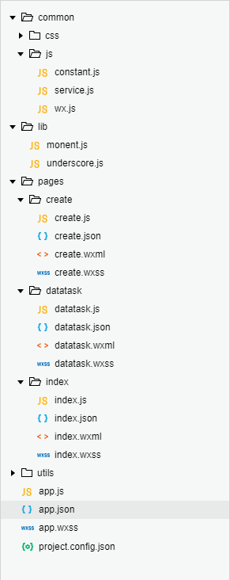

# 第9章 案例分析——日程表

随着社会节奏的变快，人们的生活内容变得更加充实，我们在享受丰富多彩生活的同时，也饱受手忙脚乱带来的烦恼，所以一款基于日程管理功能的App便是解救“大忙人”的日常必备。本章的练习项目是日程表，该项目的主要功能是计划和管理自己的日程。通过本章的学习，读者可以进一步了解如何开发和设计复杂的基于微信小程序的App。本项目的源码地址为https://github.com/wxapp-book/calendar.git。

## 9.1 业务流程

日程表App包括3个页面：首页、日程详情页、管理业。下面将分别介绍各个页面的主要功能。

首页（见图9-1）：系统的入口页面，分为三个区域：日期区域，日历区域和日程区域。日期区域默认显示当天的日期，点击后可以进入“日程管理”页面。日历区域显示当月的日历，用户可以点选日历上的日期刷新日期区域的显示信息。日程区域提供操作当天日程的功能。进入页面后，系统会自动从缓存中读取当天的日程安排，读完后根据这些日程的开始时间、结束时间，以及用户是否标记该日程已经结束，将其分为三个列表：进行中的日程列表、未开始日程列表、已结束日程列表。下面是列表说明：

* **“进行中日程”** 列表包含了当前时间晚于日程开始时间的日程，但是并不限制当前时间早于日程结束时间。这个列表会把日程的结束时间显示在界面上。用户点击这些日程后，页面底部会弹出浮层，用户可以选择更新日程，跳转的日程详情修改日程信息。也可以选择完成日程，将该日程从井下中日程列表中移除。
* **“未开始日程”** 列表包含了当前时间早于日程开始时间的日程。这个列表会把日程的开始时间显示在界面上。用户点击这些日程后，页面底层会弹出浮层，用户只有一个选项就是”修改日程“，点击后跳转日程详情页修改日程信息。
* **“已结束日程”** 列表包含了用户在“进行中日程列表”中通过“完成日程功能”从该列表中移除的日程。该列表不会展示日程的开始时间或结束时间，用户点击后也不会有浮层弹出。用户创建的日程在这个列表中完成生命周期的闭环。

日程详情页（见图9-2）：查看、修改、创建日程。日程详情页有三个入口，首页有两个，分别为创建当天的日程和修改当天的日程。日程管理页有一个入口，作用是创建不同日期的日程。日程详情页在创建或修改日程后会自动返回调用页面。

日程管理页面（见图9-3）：页面由两个区域组成，日历区域和日程区域。日程管理页只有一个入口，首页的日期区域。用户点击该区域后，会将当时显示的日期传入日程管理页面作为日程管理页面日历区域的首先日期，并且以该日期为准，向后展示七天作为可选日期，用户点击日期后，会刷新下方的日程管理区域，并且用户点击页头的添加日程按钮，会进入日程详情页为该日期添加日程。日程管理区域是一个表格，一共有24行，代表了一天的24个小时，表格的列数是根据该日期日程的多少及日程的时间分布动态生成的，具体的逻辑会在下面功能点分析小节详细介绍。

## 9.2 项目架构

### 9.2.1 功能点分析

本项目的开发难点主要有两个，第一是如何存储日程数据，第二是日程管理页面的日程区域。

存储日程数据：本章的练习项目是一个纯本地项目，没有与服务器的交互，所以，日程数据都需要存储在小程序的storage中。由于系统需要经常添加，修改和查询日程，所以一套高效和稳定的日程存储方案就是保证系统稳定的前提。

存储一共涉及了两个对象，日期对象和日程对象。这两个对象的键值分别以`data_`和`task_`开头，日期对象会以被创建日期零点的毫秒值作为结尾，而日程对象则会以当前时间的毫秒值作为结尾，这样，就保证了日期对象和日程对象的唯一性。

在创建日程之前，需要检查storage中是否保存了当前的日期对象，因为日程需要与日期关联起来才会在首页和日程管理页被查询出来。而在日期对象中，保存一个关联了当日所有日程的列表，每当创建完日程后，需要将该日程的id添加到这个列表中。

日程管理页面的日程区域：这个区域是一个表格，一共有24行，代表了一天的24个小时，表格的列数根据该日期日程的多少及日程的时间分布动态生成。在向表格添加日程的时候，会优先添加到最左边的列，如果该列的相关时间段没有其他日程，则该日程会被添加到该列，如果该列的相关时间段已有其他日程，则需检查右相邻的相关时间段是否有其他日程，如果所有列相关时间段都不满足添加的条件，则创建一个新列添加这个日程。例如图9-3所示，第一列与第二列，都有一个10:41到11:41的日程，如果这时再添加一个该时间段类的日程，则这两列都没有办法显示这个日程，需要在创建一个列去存放这个日程。

### 9.2.2 项目结构图

项目结构图如图9-4所示。



下面介绍各个部分所承担的功能。

common存放一些公共业务相关的代码，其中：

* **wx.js：** 封装一些微小小程序的底层API。在开发过程中，有一些底层的小程序API需要我们对其根据自身业务进一步封装的。
* **constant.js：** 保存系统的常量，例如一些常见的storage key。
* **service.js：** 向外提供了dataService和taskService两个类，这两个类的作用是向业务代码提供了保存、修改、读取日期和日程的功能代码。

lib存放第三方的类库，其中：

* **underscore.js：** 微信小程序的开发是基于数据模型的，所以，会有大量的数据操作，比如列表查询，数据格式转换等工作。在这里选择underscore.js作为数据处理的工具，他有很多优势如十分小巧，压缩后只有4KB；使用方法简单，它提供了几十种函数式编程的方法，大大方便了JavaScript的编程；涵盖面广，包含了操作集合、数组、函数和对象的方法；社区人气高，不用担心技术支持的问题。
* **moment.js：** 一个功能非常强大的时间操作工具。在项目开发的过程中，会大量涉及日期的操作，如改变日期的输出格式，获取下一天，获取某星期、某月的第一天和最后一天，获取某一天的开始时间的毫秒和结束时间的毫秒等，这些功能如果全部自己开发会非常耗时，而且这些功能不是我们关注的重点，所以选择了moment.js作为日期的工具库，以便我们更加关注业务的实现。

pages存放页面代码，其中：

* **create：** 日程详情页
* **daytask：** 日程管理页
* **index：** 首页

## 9.3 代码分析

在日程App里，首页与日程管理页都需要依赖日程数据，而日程详情页不需要依赖任何数据，并且日程详情页可以用来创建日程数据，所以开发时选择该页面作为入手点。日程管理页需要依赖首页作为其传入参数，而且日程管理页的开发难度较高，所以日程管理页放在了最后一个去开发。本章节的讲解顺序也会按照这个思路展开。

### 9.3.1 日程详情页

日程详情页主要用于创建和修改日程，所有与日程有关的数据都会出现在这个页面，图9-5是这个页面的数据模型。下面对数据模型中的重要字段进行分析。

* curDate：当前日程的moment对象。在进入日程详情前，用户需要选择日期或者选择一个日程。所以本页面只需使用上级页面传递过来的日期或者当前日期即可。
* pageType：用来标记当前页面是被用作创建日程还是用作修改日程，该字段有两个可选值：create和update。
* task：创建或者修改日程数据，同时也是本页面渲染需要的数据，包括开始时间、结束时间、重要性、日程内容等。这个对象最后会被保存到storage中作为日程数据供首页和日程管理页调用。
* taskImportant：日程重要性选项。日程重要性的选择会通过小程序的picker组件去实现，这个字段中的数据会作为这个组件的参数被使用。
* taskTime：为了减少交互的复杂度，用户选择日期的组件同样选择picker，这个组件在作为时间选择器的时候，可以指定可选时间的范围，通过设置这个范围，就避免了每次提交日程时去检验日期是否合法的麻烦。taskTime这个对象就是用来渲染开始时间和结束时间的对象。用户每次进入该页面或者切换开始时间时，都会触发这个对象的更新，然后刷新picker组件的行为。

代码清单9-1是日程详情页加载的代码，这段代码的主要工作就是初始化上文提到的五个页面模型指定。首先，传入该方法的参数可能有两个，pageType和key。当pageType为create时不会有key传入，会初始化一个默认的task对象。而当pageType为update时，就会有key对象传入，这时就需要根据这个key从storage中获取对应的task对象供页面渲染所用。

代码清单9-1日程详情页加载

```js
onLoad: function(options) {
    var pageType = options.pageType || 'create';
    var task;
    var curDate;
    if (pageType === 'create') {
        var ms = options.ms || new Date().getTime();
        curDate = moment(ms, "x");
        task = {
            title: "新建日程",
            important: "一般",
            date: moment(ms, 'x').format("YYYY-MM-DD")
        };
    } else {
        var key = options.key;
        if (key) {
            task = taskService.get({
                key: key
            });
            curDate = moment(task.startTimeMs);
        }
    }
    this.setData({
        curDate: curDate
    });
    var taskTime = _fn.getTaskTime(task);
    var taskImportant = ['一般', '重要'];
    this.setData({
        task: task,
        taskTime: taskTime,
        taskImportant: taskImportant,
        pageType: pageType,
    });
}
```

代码清单9-2是刷新taskTime对象的方法。这个方法会在用户修改开始日期、结束日期或者选择是否全天日程时被调用。这段代码的主要逻辑是，在刚进入页面时，开始时间和结束时间分别为当前时间和当前时间向后推移一个小时，在用户修改开始时后，如果结束时间早于开始时间，则将结束时间设置为开始时间向后推移一个小时。日程开始时间的限制始终都不能早于当前时间，日程结束时间的限制为始终都不能早于日程开始时间。

代码清单9-2刷新taskTime对象方法

```js
getTaskTime: function(task) {
    task = task || {};
    var now = utils.getPageData().data.curDate;
    var dateStr = task.date || now.format('YYYY-MM-DD');
    var curTask = _fn.getCurTask() || task || {};
    var startTime = curTask.startTime ? curTask.startTime : now.format("HH:mm");
    var startTimeMoment = moment(dateStr + " " + startTime);
    var endTimeMoment;
    if (curTask.endTime) {
        endTimeMoment = moment(dateStr + " " + curTask.endTime);
        if (!endTimeMoment.isAfter(startTimeMoment)) {
            endTimeMoment = moment(startTimeMoment);
            endTime = endTimeMoment.add(1, 'h').format("HH:mm");
        } else {
            endTime = curTask.endTime;
        }
    } else {
        endTimeMoment = moment(startTimeMoment);
        endTimeMoment = endTimeMoment.add(1, 'h');
        endTime = endTimeMoment.format("HH:mm");
    }
    curTask.startTimeMs = startTimeMoment.valueOf();
    curTask.endTimeMs = endTimeMoment.valueOf();
    curTask.startTime = startTime;
    curTask.endTime = endTime;


    var startTimeBeginLimit = now.format("HH:mm");
    var endTimeBeginLimit = startTime;

    var taskTime = {
        startTime: startTime,
        endTime: endTime,
        startTimeBeginLimit: startTimeBeginLimit,
        endTimeBeginLimit: endTimeBeginLimit,
        date: dateStr

    };
    return taskTime;
}
```

代码清单9-3是用户点击添加或者修改后执行的代码，这里调用taskService的create和update方法去保存日程数据，保存成功后，返回上级页面。这里使用了同步的方法去保存日程数据，是因为保存完成后会马上回到上级页面，上级页面会立即读取storage中的日程数据。这样就需要保证缓存中的数据是包含新添加的日程数据的。如果采用异步的方式，是无法保证这点的，导致首页或者日程管理页上将看不到这条新添加的日程数据。

代码清单9-3保存日程事件/修改日程事件

```js
saveTask: function(e) {
    var task = _fn.getCurTask();
    taskService.creat(task);
    wx.navigateBack({
        delta: 1
    });
}
```

```js
updateTask: function(e) {
    var taskKey = e.target.dataset.taskkey;
    var task = _fn.getCurTask();
    taskService.update({
        key: taskKey,
        val: task
    });
    wx.navigateBack({
        delta: 1
    });
}
```

代码清单9-4是在service.js中的保存日程代码。这段代码可以分为三个部分，第一个部分是获取date对象，第二个部分是保存日程对象，第三个部分是向日期对象添加日程对象。下边介绍这三个部分中涉及的具体代码逻辑。

代码清单9-4保存日程

```js
creat: function(task) {
    //第一部分：获取时间对象
    var ms = task.startTimeMs; //日程开始时间的毫秒值
    //读取该毫秒对应缓存的日期对象
    var date = dateService.get({
        ms: ms
    });
    var dateKey;
    if (!date) {
        dateKey = dateService.create({
            ms: ms
        });
        date = dateService.get({
            key: dateKey
        });
    } else {
        dateKey = date.key;
    }
    //第二部分：保存日程对象
    var taskKey = taskService.getTaskKey(moment().valueOf());
    task.key = taskKey;
    wxService.setStorage({
        key: taskKey,
        val: task
    });
    //第三个部分：向日期对象添加日程对象
    date.taskKeys = date.taskKeys || [];
    date.taskKeys.push(taskKey);
    dateService.update({
        key: dateKey,
        val: date
    });
}
```

在第一部分中，需要获取storage中日期对象的key值，日期对象的key值规定：以`date_`开头，以某个日期零时的毫秒值作为结尾。在代码清单9-4中，通过参数中的毫秒值，得到对应的moment对象，又通过moment对象的startOf方法，得到对应日期零时的毫秒值。保存日期时获取key值，也是通过这个方法得到一个key之后使用这个key保存日期对象的。只要保证保存时和读取时，传入该方法的毫秒值在同一天，就可以得到相同的key值，如下代码所示。

```js
getDateKey: function(ms) {
    var dateKey = 'date_' + moment(ms).startOf('day').valueOf();
    return dateKey;
}
```

在第二部分中，需要生成日程的key，日程对象的key值规定，以`task_`开头，以创建时间的毫秒值作为结尾。通过这个方法，就可以保证日程对象在storage中的唯一性，如下所示：

```js
getTaskKey: function(ms) {
    var taskKey = 'task_' + ms;
    return taskKey;
}
```

图9-6是date对象和task对象在storage中存储的截图。可以发现，日期对象中有一个列表对象taskKeys。 这个对象就是映射该日期下关联的日程对象的。保存日程对象的第三部分就是将新生成的日程对象的key值添加到该对象中。

### 9.3.2 首页

首页的内容可以分为三个区域，日期区域、月历区域和日程区域。图9-7是首页的数据模型，下面对其中的重要字段做解释：

* calendar：渲染当月日历的字段。这个字段保存了一个星期纬度和日期纬度的二维数组。
* days：显示星期几的映射指定。
* groupTask：日程区域的渲染指定。日程区域会将当日的日程分成三个部分，未完成的日程，完成的日程和未开始的日程。
* selectDate：日期区域的渲染指定。每次用户选择月历区域的日期时，都会刷新这个字段的数据。

代码清单9-5是首页加载的代码，这段代码的主要逻辑是初始化页面数据模型中的字段。这里调用了小程序的两个生命周期函数：onLoad和onShow方法。onLoad方法只会被调用一次，所以这段代码只加载了日历和当天的日期数据。onShow方法会在每次进入这个页面时被调用。当该页面是从日程管理页或者日程详情页回来时，当天的日程数据有可能发生变化，为了与storage中的日程数据同步，需要每次进入页重新读取并生成groupTask指定，onShow中的`_fn.init`方法就是执行这个过程的。

代码清单9-5页面加载

```js
onLoad: function() {
    // wxService.clearStorage();
    _fn.getCurPage().setData({
        now: new Date().getTime(),
        days: constant.calendar.dayShort,
        calendar: calendar.getCalendarData('m'),
        selectDate: calendar.getToday()
    });
}
```

```js
onShow: function() {
    _fn.init();
}
```

代码清单9-6是获取页面模型groupTask的字段。由于首页的日程区域只会显示当天的日程，所以只需传递当天一个毫秒值。在获取到当天的日程列表后，将这个日程列表按照其状态分成三个列表，分别为未开始、未完成和已完成。然后将未开始的日程按照开始时间升序排列，未完成的日程按照结束时间的升序排列，已结束的日程按照结束时间降序排列。

代码清单9-6获取渲染日程区数据

```js
groupTask: function() {
    var ms = new Date().getTime();
    taskService.getDayTasks({
        ms: ms
    }, function(taskList) {
        var penList = taskService.filterTaskByStatus(taskList, constant.taskStatus.pending);
        var curList = taskService.filterTaskByStatus(taskList, constant.taskStatus.current);
        var finList = taskService.filterTaskByStatus(taskList, constant.taskStatus.finish);

        penList = taskService.orderTaskByStartTime(penList, constant.orderType.asc);
        curList = taskService.orderTaskByEndTime(curList, constant.orderType.asc);
        finList = taskService.orderTaskByEndTime(finList, constant.orderType.desc);

        var groupTask = {
            penList: penList,
            curList: curList,
            finList: finList
        };
        _fn.getCurPage().setData({
            groupTask: groupTask
        });
    });
}
```

代码清单9-7是获取某日期日程数据的方法，这个方法位于service.js的taskService对象内部。这个方法是一个公共服务，主要实现了通过一个毫秒值获取该毫秒对应日期内用户创建的日程，同时该方法提供了同步方式调用和异步方式调用，区别在于是否传递了callBack参数。方法首先根据毫秒读取storage中的日期对象，接着遍历该对象中的taskKeys数组从而得到该日期下的所有日程key，然后通过同步的方式得到日程对象并将其保存在一个列表中。

代码清单9-7获取某日期的日程数据

```js
getDayTasks: function(option, callBack) {
    var ms = option.ms;
    var getTasks = function(date) { //根据日期对象中的taskKeys对象获取日程对象
        var taskKeyList = date.taskKeys || [];
        var taskList = [];
        for (var i = 0; i < taskKeyList.length; i++) {
            taskList.push(taskService.get({
                key: taskKeyList[i]
            }));
        }
        if (callBack && typeof callBack === 'function') {
            callBack(taskList);
        } else {
            return taskList;
        }
    };
    if (callBack && typeof callBack === 'function') { //异步
        dateService.get({
            ms: ms
        }, function(result) { //从storage中得到ms对应的日期对象
            getTasks(result); //
        });
    } else {
        var taskList = dateService.get(); //同步
        return getTasks(taskList);
    }
}
```

代码清单9-8是根据日程状态过滤日程列表的代码，这个方法位于service.js的taskService对象内部。为了方便用户了解当日日程的进展程度，在系统内部为日程定义了三个状态，分别为未开始、未结束和已结束，定义位于constant.js内部。该方法通过调用js的数组原生方法Array.filter去过滤参数taskList。已结束的日程是在日程对象上添加status=finish来实现的。未开始和未结束的日程则是根据当前时间与日程开始时间的前后关系来决定，在代码中这个判断是借助momentjs的isBefore方法和isAfter方法来实现的。

代码清单9-8根据日程状态过滤日程列表

```js
filterTaskByStatus: function(taskList, status) {
    var returnList = taskList;
    returnList = taskList.filter(function(a) {
        var momentStart = moment(a.startTimeMs); //日程开始时间的moment对象
        var momentEnd = moment(a.endTimeMs); //日程结束时间的moment对象
        var now = moment();
        var taskStatus = a.status;
        if (constant.taskStatus.pending === status) {
            if (now.isBefore(momentStart)) { //当前时间早于开始时间
                return true;
            }
        } else if (constant.taskStatus.current === status && taskStatus !== constant.taskStatus.finish) {
            if (now.isAfter(momentStart)) { //当前时间晚于开始时间，并且用户未标记日程结束
                return true;
            }
        } else if (constant.taskStatus.finish === status) {
            if (taskStatus === constant.taskStatus.finish) { //用户标记日程结束
                return true;
            }
        }
    });
    return returnList;
}
```

代码清单9-9是计算日历数据的代码。这段代码位于util.js的calendar对象中。方法的入口为getCalendarData，获取日历的类型分为按周获取和按月获取。按周获取月历的方法是getWeekData，该方法首先获取参数毫秒值对应周的开始日期和结束日期，使用的方法是momentjs的startOf和endOf方法，同时声明一个基准日期为周开始时间，接下来便是将这个基准日期按天相加知道周结束日期，每次相加后会判断相加后的日期是否为今天并且将其标记，返回的结果是一个长度为7的一维数组。按月获取月历的方法是getMonthData，这个方法与getWeekData方法的思路类似，不同的是首先获取参数毫秒值对应月的开始日期和结束日期，日期递增的方式不是一天而是七天，最后递增到大于或者等于月结束日期，最后返回的数据是当月的所有周的数据。由于月历数据是按照周去计算日期，所以难免会包含不属于当月的日期，所以在使用月历数据渲染页面的时候需要隐藏

## 9.4 小结

本章案例项目的难点有两个：

* 1）设计和使用较为复杂的缓存：在日程表App的storage中保存日期数据和日程数据，这两个数字的关系是一对多。在代码结构设计时，将代码分成了数据操作层和业务层。数据操作层需要考虑向业务层提供同步和异步的方式读写数据的接口。业务层则只需专心搞好页面渲染和用户交互即可。
* 2）将复杂的界面数据模型化：日程操作页的日程表是一个渲染逻辑比较复杂的组件。业务的目的是形象地查看每个日程的时间长度。设计时就需要将这个业务抽象成为一个表格，之后思考表格中的每个格子怎么渲染，最后设计渲染数据，保证以最简单的方式达到业务的需求。